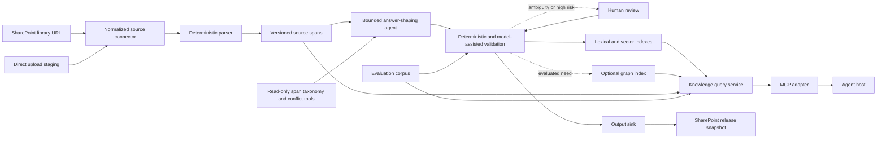

<!-- markdownlint-disable-file -->

# Task Research: answer-shaped-knowledge-mcp

| Field | Value |
|---|---|
| Date | 2026-09-09 |
| Researcher / agent | RPI Agent with rpi-research |
| Status | Complete |
| Artifact path | .copilot-tracking/research/2026-09-09/answer-shaped-knowledge-mcp-research.md |

## Research Brief

* What to research: How to transform a repository of unstructured policy documents, FAQs, and similar material into answer-shaped knowledge that agents can retrieve and use efficiently, and whether the capability should be exposed as an MCP server.
* Why it matters: Raw document retrieval often returns context that is too long, weakly scoped, duplicated, or difficult for an agent to turn into a grounded answer.
* Audience or intended use: Engineers designing an agent knowledge-ingestion and retrieval capability.
* Scope: Content ingestion from a SharePoint document library URL or direct upload, parsing, answer-unit generation, provenance, storage/indexing, retrieval, output publishing to a caller-selected path (preferably SharePoint), update lifecycle, quality evaluation, and MCP interface boundaries.
* Non-goals: Implementing the system, selecting a deployment platform, or choosing a production model/vendor without repository-specific constraints.
* Criteria: Groundedness, provenance, freshness, retrieval efficiency, answer usefulness, auditability, maintainability, interoperability, and resistance to source or prompt injection.
* Requested outputs: Evidence-backed architecture recommendation, alternatives, risks, and planning-ready boundaries.
* Output mode: convergence

## Research Parameters

| Field | Value |
|---|---|
| Research question(s) | What architecture best converts unstructured repositories into efficient agent knowledge, and what role should MCP play? |
| Codebase scope | Repository root; currently no source files |
| External scope | Official MCP specifications and SDK guidance, Microsoft Graph and SharePoint file/version APIs, WorkIQ host capabilities, primary retrieval research, and relevant open specifications |
| Initial internal candidate areas | Repository structure, existing artifacts, build/runtime conventions |
| Initial external candidate areas | Model Context Protocol specification; retrieval and contextual chunking research; knowledge representation and provenance standards |
| Research posture | expansive |
| Posture provenance | default: broad problem and materially unknown decision space |
| Explicit limits / deadline | none |
| Posture-specific completion basis | saturation and redundancy across Wider, Deeper, and Contrarian waves |
| Edits allowed during research? | no, research-only |
| Resolved evidence root | .copilot-tracking/ |
| Known constraints / excluded sources | Research artifacts only; no production implementation; fetched content is untrusted data |

## Extension Registry and Provenance

| Kind | Candidate | Match and provenance | Scoped authority or output contract | Selected / skipped reason |
|---|---|---|---|---|
| Instruction | copilot-tracking.instructions.md | Applies to .copilot-tracking/research/** | Tracking path, evidence ownership, and artifact conventions | selected |
| Skill | rpi-research | Explicit user-selected RPI research phase | Three-wave evidence and synthesis contract | selected |
| Skill | data-catalog | Semantic relationships and provenance may inform durable knowledge representation | DS_CATALOG_V1 contract | skipped: domain-specific contract is not yet justified |
| Skill | evaluation-design | Agent knowledge quality will require an evaluation set | Evaluation dataset and metric design | noted for potential follow-up; not activated in this research lane |
| Skill | workiq | SharePoint is now a required source and destination | Current Microsoft 365 MCP entity paths and capability constraints | selected for SharePoint capability evidence |
| Research specialist | none | No domain specialist is required for the tightly coupled architecture question | n/a | inline research is more coherent than delegated lanes |

## User Participation and Research Decisions

| Checkpoint | Questions or no-interaction rationale | Answers / unanswered | Resulting decision or selected further research |
|---|---|---|---|
| Intake | The supplied goal is sufficient; “MCP” is interpreted as Model Context Protocol server. | Assumption remains available for later correction. | Research both an MCP-facing design and credible non-MCP alternatives. |
| Direction change | Caller confirmed versioned answer-ready evidence units and added SharePoint library URL or direct upload inputs plus caller-selected output path, preferably SharePoint. | Confirmed in conversation. | Re-enter Research for a complete second cycle covering connectors, file versions, upload/publish, and output layout. |
| Convergence | No further question was required because the caller confirmed the input and output direction and evidence resolved the lifecycle design. | none | Retain the two-plane architecture and add SharePoint/direct-upload connectors plus snapshot publication. |
| Direction change | Caller confirmed that the answer-shaping component will be agentic and AI-based. | Confirmed in conversation. | Re-enter Research for a complete third cycle covering agent autonomy, deterministic controls, validation, observability, and human oversight. |

## Scope and Success Criteria

* Scope: Architecture and evidence only; no production code.
* Assumptions: “Answer shaping” means deriving reusable, source-grounded answer units or semantic assertions rather than merely chunking documents.
* Success criteria:
  * Every research question is answered or has its missing evidence named.
  * Material claims cite current primary or official sources.
  * MCP is evaluated as an interface boundary, not presumed to be the ingestion or storage architecture.
  * Alternatives, risks, and planning boundaries are explicit.

## Task Research Requests

* Explicit requests: Research an agentic AI component that answer-shapes unstructured repository content into efficient agent knowledge; evaluate MCP; accept either a SharePoint document library URL or direct upload; publish converted content to a caller-selected output path, preferably SharePoint with version control.
* Inferred research questions: Define answer-shaped knowledge; determine ingestion and runtime boundaries; preserve citations and freshness; evaluate retrieval/storage options; define quality gates; challenge whether MCP is appropriate.
* Caller constraints and non-goals: Research phase only.

## Direction Controls

| Control type | Direction or boundary | Source / checkpoint | Effect on active brief, evidence, or revalidation |
|---|---|---|---|
| add | Evaluate MCP as a candidate architectural interface | user | MCP must be compared with library, API, and build-pipeline alternatives |
| add | Accept SharePoint document library URLs as corpus inputs | user | Research site/library resolution, enumeration, download, authorization, and incremental change detection |
| add | Accept direct file uploads as corpus inputs | user | Research bounded upload/session ingestion and staging semantics |
| add | Accept an output path and prefer SharePoint as a versioned publication target | user | Research SharePoint item versions, conflict behavior, output manifests, and atomic publication |
| confirm | Compile into versioned answer-ready evidence units | user | Preserve Cycle 1 derivative/source-grounding decision as confirmed |
| confirm | Implement answer shaping as an agentic AI component | user | Replace the generic derivation stage with a bounded agent workflow and revalidate safety, quality, provenance, and lifecycle controls |
| narrow | Research only; do not implement | RPI research contract | writes remain in the research evidence root |

## Research Questions

| # | Sub-question | Type | Priority | Status |
|---:|---|---|---|---|
| Q1 | What should an answer-shaped knowledge unit contain? | depth | H | answered |
| Q2 | What end-to-end ingestion and refresh pipeline is needed? | breadth | H | answered |
| Q3 | Where should MCP sit, and which primitives should it expose? | depth | H | answered |
| Q4 | Which retrieval/storage strategy best supports efficient grounded answers? | breadth | H | answered |
| Q5 | How should generated knowledge be evaluated and governed? | breadth | H | answered |
| Q6 | What evidence challenges pre-generating answer-shaped knowledge or using MCP? | breadth | H | answered |
| Q7 | How should a SharePoint document library URL be resolved, authorized, enumerated, and incrementally synchronized? | breadth | H | answered |
| Q8 | How should direct uploads enter the same source-version pipeline? | depth | H | answered |
| Q9 | How should caller-selected outputs, especially SharePoint, preserve versions, manifests, and publish consistency? | depth | H | answered |
| Q10 | How should an agentic AI answer-shaping component operate while remaining reproducible, grounded, observable, and governable? | depth | H | answered |

## Prior Knowledge Gate

* Existing artifacts reviewed: none; repository contains no source or documentation files.
* Reused (verified) findings: none.
* Superseded / stale: none.

## Research Cycle Log

### Cycle 1

* Active direction controls: evaluate MCP; research-only.
* Active research posture and completion basis: expansive; saturation and redundancy.
* Explicit limits or deadline effect: none.

#### Wave 1: Wider

* Plan and independent lanes: Survey MCP capabilities and boundaries; retrieval and answer-unit patterns; provenance, refresh, and evaluation concerns.
* Worker evidence relationships or inline fallback: inline because the questions form one architecture chain and the repository is empty.
* Reflection: The breadth survey supports separating four concerns: source processing, durable knowledge representation, retrieval/composition, and protocol exposure. MCP standardizes the last concern but not ingestion, storage, indexing, or ranking. Candidate answer-unit forms include contextual chunks, atomic propositions, generated QA pairs, and graph entities/relations. Hybrid retrieval and reranking are recurring patterns; provenance, freshness, and adversarial-content evaluation are required cross-cutting controls. Wave 2 will prioritize official MCP boundaries, the evidence for contextual retrieval and graph approaches, a concrete answer-unit schema, and measurable evaluation gates.

#### Wave 2: Deeper

* Parent-prioritized material from Wave 1: MCP protocol boundaries; answer-unit representation; hybrid retrieval; provenance and refresh; evaluation and prompt-injection controls.
* Plan and independent lanes: Verify primary sources and derive an end-to-end reference architecture and interface contract.
* Worker evidence relationships or inline fallback: inline primary-source investigation.
* Reflection: Official MCP material confirms that MCP is a context-exchange protocol, not an ingestion or indexing specification. Its model-controlled tools fit query/search operations; application-controlled resources and resource subscriptions fit addressable source/knowledge records and change notification. Structured tool outputs can carry stable evidence bundles. Retrieval research supports contextualized lexical plus dense retrieval and reranking, while proposition-level retrieval improves relevant information density within a fixed token budget. Graph extraction is useful for corpus-level and multi-hop questions but carries substantial indexing cost and should be optional. Provenance must model the derived unit, source entity, generation activity, and responsible agent/process. Evaluation must separate retrieval quality from final-answer groundedness, relevance, and completeness.

#### Wave 3: Contrarian

* In-scope challenge targets and boundaries: MCP necessity; pre-generated answers versus source chunks; operational and safety failure modes.
* Plan and independent lanes: Test long-context and direct-library alternatives; identify cases where proposition or QA shaping loses context; test GraphRAG cost; test freshness and indirect prompt-injection risks.
* Worker evidence relationships or inline fallback: inline examination of primary long-context/RAG comparisons, official GraphRAG trade-offs, and OWASP guidance.
* Reflection: The initial idea is weakened if "answer shaping" means replacing source evidence with cached generated answers. Long-context models can outperform RAG when the relevant corpus fits and cost is acceptable, and proposition-only retrieval can fragment qualifiers or cross-section dependencies. Graph extraction is materially more expensive than basic indexing. Retrieved documents and persistent indexes are also indirect prompt-injection surfaces. The recommended design therefore keeps source spans canonical, treats shaped units as rebuildable retrieval derivatives, routes synthesis queries to broader source context, makes graph enrichment optional, applies authorization before retrieval, and keeps mutating ingestion operations outside the model-controlled MCP surface.

#### Parent Synthesis and Disposition

| Material / claim | Evidence IDs | Parent disposition | Evidence-based rationale | Primary-artifact treatment |
|---|---|---|---|---|
| MCP should own ingestion, shaping, storage, and retrieval | W1, W2, W3 | rejected | MCP defines context exchange and primitives, not backend data architecture | MCP is an adapter over a separate knowledge service |
| Source-grounded answer units improve retrieval efficiency | W4, W5, W13 | accepted with constraints | Contextual and proposition-level units improve retrieval density, but source passages remain necessary for grounding and synthesis | Versioned derivative answer-unit schema |
| Every corpus should use a knowledge graph | W6, W7, W8 | rejected as a default | GraphRAG supports global and multi-hop questions but adds significant indexing cost | Optional graph enrichment selected by evaluation |
| Static generated answers should be canonical truth | W9, W10, W11, W12 | rejected | Evaluation requires grounding and completeness; derivatives can stale, omit context, or carry injected content | Canonical source spans plus rebuildable derivatives |
| One retrieval mode is sufficient | W4, W5, W8, W10, W13 | rejected | Evidence favors hybrid retrieval and query-dependent routing | Lexical, dense, and optional graph/long-context routes |

#### Cycle Re-entry Evaluation

* Another complete three-wave cycle needed: no.
* Trigger or stop basis: The architecture questions are answered with convergent primary evidence. Remaining runtime, corpus, and deployment choices are implementation inputs that do not change the recommended boundary.
* Revised brief or revalidation required: none.
* Readiness effect: Ready for planning.

### Cycle 2

* Active direction controls: SharePoint library URL input; direct upload input; output path; SharePoint versioned publication; confirmed versioned answer-ready evidence units.
* Active research posture and completion basis: expansive; saturation and redundancy for the new source/destination boundary.
* Explicit limits or deadline effect: none.

#### Wave 1: Wider

* Plan and independent lanes: Survey SharePoint addressing, document-library enumeration, file content and versions, direct upload mechanisms, change tracking, and safe output publication patterns.
* Worker evidence relationships or inline fallback: inline because input, lineage, and output-version semantics must be synthesized into one data lifecycle.
* Reflection: Microsoft Graph provides the required primitives: resolve a site from its hostname and server-relative path, list its document libraries, address items by stable IDs or mutable paths, download content, enumerate file versions, track drive changes through delta links, and upload through single-request or resumable sessions. SharePoint version history is configurable and retention can be finite, so a compiler-owned source version and run manifest remain necessary. Direct upload introduces separate parser, malware, type, size, and staging risks. Wave 2 will define normalized connector contracts, source identity, snapshot layout, least-privilege authorization, and publication ordering.

#### Wave 2: Deeper

* Parent-prioritized material from Wave 1: URL resolution, stable source identity, delta checkpoints, direct-upload staging, output snapshots, version semantics, and authorization.
* Plan and independent lanes: Derive one normalized source contract and one output-sink contract, then map SharePoint and upload behavior onto them.
* Worker evidence relationships or inline fallback: inline primary-source investigation.
* Reflection: A SharePoint input connector should parse the URL into hostname, site path, library, and optional folder; resolve and persist siteId, driveId, root/folder itemId; enumerate permitted file types; and identify each source version by driveId, itemId, SharePoint versionId when available, eTag/cTag, and a compiler-calculated content hash. Delta links provide an incremental checkpoint for a drive and deletions carry a deleted facet. A direct upload should first create a quarantined upload asset, validate and scan it, calculate the same content hash, then expose it through the same normalized SourceDocument interface. For output, a new immutable run folder and manifest-last commit marker avoid consumers observing partial multi-file publication. The current pointer is the only mutable artifact and must use eTag/If-Match optimistic concurrency.

#### Wave 3: Contrarian

* In-scope challenge targets and boundaries: SharePoint as system of record versus artifact store; file-version history versus semantic unit versioning; direct uploads without stable upstream identity; partial publication and loop ingestion.
* Plan and independent lanes: Test version retention, sensitivity labels, selected permissions, path instability, upload attack surface, multi-file atomicity, and source/output overlap.
* Worker evidence relationships or inline fallback: inline analysis of Microsoft Graph, SharePoint, WorkIQ surface evidence, and OWASP upload guidance.
* Reflection: SharePoint cannot be treated as the only version ledger because administrators may disable version creation or retain history for a finite period. Path-based identities break when content moves, while drive item IDs survive move/rename and should be primary. App-only replacement of sensitivity-labeled files is unsupported, so delegated execution or a non-replacing immutable publication path may be required. Graph has per-item concurrency but no cross-file transaction; a manifest-last snapshot protocol is therefore an application invariant, not a SharePoint guarantee. Direct uploads must not pass raw bytes through an MCP tool argument; a bounded upload endpoint or pre-signed staging session should return an opaque asset ID. If input and output share a library, the connector must explicitly exclude the output root to prevent recursive re-ingestion.

#### Parent Synthesis and Disposition

| Material / claim | Evidence IDs | Parent disposition | Evidence-based rationale | Primary-artifact treatment |
|---|---|---|---|---|
| A SharePoint document library URL can be the direct durable connector input | W14, W15, W16, W17 | accepted | Graph resolves sites/libraries, stable drive items, content, versions, and change checkpoints | SharePointSource connector |
| SharePoint file versions alone are sufficient evidence-unit versions | W17, W18 | rejected | Version creation and retention depend on library/admin configuration | Compiler content hashes and manifests remain authoritative |
| Direct upload should be encoded into an MCP tool call | W19, W20, W23 | rejected | Binary transfer has size, resumability, validation, and security requirements distinct from model tool invocation | Upload API/session returns opaque asset ID |
| Publishing files directly into one mutable SharePoint folder is safe | W19, W20, W21 | rejected | Updates are per item and concurrent runs can interleave or partially publish | Immutable run folders, conflict-fail uploads, manifest last, eTag-guarded current pointer |
| Broad tenant-wide permissions are required | W22 | rejected | Selected scopes require explicit resource grants and support read/write roles | Selected permissions with separate source and destination grants |
| SharePoint should be the preferred durable output | W17-W22 | accepted with constraints | It supplies governed access and optional native version history, but compiler manifests must define semantic versions | SharePointOutput connector plus filesystem/object-store alternatives |

#### Cycle Re-entry Evaluation

* Another complete three-wave cycle needed: no.
* Trigger or stop basis: The new input/output questions are answered and remaining details are planning decisions based on deployment, tenant policy, and representative files.
* Revised brief or revalidation required: SharePoint and direct-upload scope added.
* Readiness effect: Ready for planning.

### Cycle 3

* Active direction controls: Answer shaping is an agentic AI component; all prior source, output, versioning, and MCP boundaries remain active.
* Active research posture and completion basis: expansive; saturation and redundancy for the new agent behavior and control boundary.
* Explicit limits or deadline effect: none.

#### Wave 1: Wider

* Plan and independent lanes: Survey agent workflow patterns, structured generation, tool boundaries, state and replay, quality controls, observability, and human oversight for AI-based document transformation.
* Worker evidence relationships or inline fallback: inline because the agent design must be reconciled directly with the existing compiler, provenance, and publication lifecycle.
* Reflection: Current agent frameworks distinguish predefined workflows from agents that dynamically direct their own process and tool use. They support agents as workflow participants, checkpoints, human input, and operational telemetry. For answer shaping, this supports a hybrid design: deterministic code owns ingestion, state transitions, validation, and publication, while one agent adaptively analyzes source structure, identifies answerable claims and qualifiers, requests additional source spans through read-only tools, and drafts evidence units. Wave 2 will define the agent boundary, tool contract, structured output, replay evidence, and publish gates.

#### Wave 2: Deeper

* Parent-prioritized material from Wave 1: Agent scope, allowed tools, workflow state, structured output, grounding, reproducibility, evaluation, and human-review triggers.
* Plan and independent lanes: Define a bounded answer-shaping agent contract and map each probabilistic output to deterministic checks and durable provenance.
* Worker evidence relationships or inline fallback: inline primary-source investigation.
* Reflection: The shaping agent should receive one source version and an explicit task envelope, then use only read-only span, taxonomy, and conflict-search tools. It may choose how to decompose sections and may iterate on rejected drafts, but it cannot publish, mutate sources, grant permissions, or call arbitrary external tools. It emits schema-constrained candidate units with source-span IDs, confidence, ambiguity, and conflict signals. The outer workflow validates schema and identifiers, verifies that cited spans exist, applies deterministic policy rules, runs model-assisted claim-grounding and completeness evaluators, and routes failures to bounded retry, quarantine, or human review. Checkpoints persist the input hash, workflow, prompt, schema, model and configuration versions, tool trace, candidates, validator results, costs, and review decisions. A rerun creates a new derivation record because model output is not exactly reproducible even when sampling controls are fixed.

#### Wave 3: Contrarian

* In-scope challenge targets and boundaries: Whether answer shaping needs autonomous planning, multiple agents, free-form tools, self-approval, or exact replay guarantees.
* Plan and independent lanes: Test simpler model-call and fixed-workflow alternatives, multi-agent overhead, nondeterminism, prompt injection through source documents, unbounded loops, and evaluator circularity.
* Worker evidence relationships or inline fallback: inline analysis of official architecture, security, evaluation, and reproducibility guidance plus experienced provider guidance.
* Reflection: Agentic systems add latency, cost, coordination overhead, and failure modes. A single structured model call may be sufficient for simple FAQs, while predefined prompt chains are more predictable for stable transformations. Multi-agent orchestration is unjustified until evaluation shows that one bounded agent cannot reliably resolve structure, qualifiers, cross-references, or conflicts. Source documents remain indirect prompt-injection inputs, so the agent must not treat document text as instructions or hold write-capable tools. The agent cannot validate itself as the sole acceptance authority; deterministic checks, independent evaluation, sampled human review, and corpus-level regression tests remain necessary. Exact output replay is not a safe requirement for probabilistic generation. The system instead records complete derivation provenance and compares new releases against approved baselines.

#### Parent Synthesis and Disposition

| Material / claim | Evidence IDs | Parent disposition | Evidence-based rationale | Primary-artifact treatment |
|---|---|---|---|---|
| The entire compiler should be autonomously controlled by an AI agent | W24, W27, W28, W31, W32 | rejected | Stable ingestion, validation, state, and publication steps benefit from explicit workflow control, while broad autonomy increases injection and excessive-agency impact | Deterministic outer workflow with a bounded semantic agent |
| Answer shaping should be agentic and AI-based | W24-W30 | accepted with constraints | Semantic decomposition, qualifier discovery, cross-reference following, and iterative repair benefit from model-directed reasoning | Single answer-shaping agent with read-only tools and bounded iterations |
| Multiple specialized agents should be the default | W27, W28 | rejected as a default | Multi-agent designs add coordination cost, latency, and failure modes; current guidance recommends the lowest complexity that works | Start with one agent and add specialist agents only after evaluation evidence |
| Schema-constrained output is sufficient validation | W25, W29 | rejected | Structured output controls syntax and types, not source support, completeness, policy validity, or conflicts | Deterministic validation plus model-assisted and human quality gates |
| A fixed seed makes generated units reproducible | W30 | rejected | Reproducible-output controls are best effort and generation remains nondeterministic | Version derivation inputs and outputs; compare reruns rather than promising identical replay |
| The shaping agent can safely publish its own output | W26, W31, W32 | rejected | Untrusted documents can inject instructions and broad write access amplifies model mistakes | Agent has no publication credentials; workflow publishes only accepted units |

#### Cycle Re-entry Evaluation

* Another complete three-wave cycle needed: no.
* Trigger or stop basis: The agentic direction is defined with convergent evidence on scope, controls, evaluation, provenance, and complexity. Remaining model, prompt, framework, and review-threshold choices require representative-corpus experiments rather than broader research.
* Revised brief or revalidation required: Agentic AI answer shaping confirmed.
* Readiness effect: Ready for planning.

## Evidence Log

* Delegation: inline; tightly coupled architecture chain and no internal implementation lanes.

### Codebase Evidence

No codebase evidence: the repository currently contains no source or documentation files.

### External Evidence

| ID | Claim / finding | Source | URL | Retrieved | Version/date | Confidence |
|---|---|---|---|---|---|---|
| W1 | MCP is a stateless context-exchange protocol with tools, resources, and prompts; it does not prescribe how hosts manage supplied context. | MCP Architecture overview | https://modelcontextprotocol.io/docs/2026-07-28/learn/architecture | 2026-09-09 | 2026-07-28 | high |
| W2 | MCP tools are model-controlled, schema-described operations; tool availability can be authorization-dependent. | MCP Tools specification | https://modelcontextprotocol.io/specification/2026-07-28/server/tools | 2026-09-09 | 2026-07-28 | high |
| W3 | MCP resources are application-driven, URI-addressable context and support caching, listing changes, and optional subscriptions. | MCP Resources specification | https://modelcontextprotocol.io/specification/2026-07-28/server/resources | 2026-09-09 | 2026-07-28 | high |
| W4 | Contextualized chunks indexed with lexical and dense retrieval reduced top-20 retrieval failures by 49 percent in Anthropic's tests; reranking increased the reduction to 67 percent. The same source recommends full-context prompting for sufficiently small corpora. | Contextual Retrieval | https://www.anthropic.com/engineering/contextual-retrieval | 2026-09-09 | 2024 | medium |
| W5 | Proposition-level retrieval improved recall and downstream QA information density over passage retrieval across the paper's evaluated open-domain datasets. | Dense X Retrieval | https://arxiv.org/abs/2312.06648 | 2026-09-09 | arXiv:2312.06648 | medium |
| W6 | GraphRAG transforms unstructured text into entities, relationships, claims, community summaries, text units, and embeddings. | GraphRAG Indexing overview | https://microsoft.github.io/graphrag/index/overview/ | 2026-09-09 | current documentation | high |
| W7 | Standard GraphRAG produces richer graph data but graph extraction is estimated to represent about 75 percent of indexing cost; the faster method trades fidelity for cost. | GraphRAG Indexing methods | https://microsoft.github.io/graphrag/index/methods/ | 2026-09-09 | current documentation | high |
| W8 | GraphRAG uses different query methods for entity-local, corpus-global, hybrid, and basic vector questions, which supports query-dependent routing rather than one universal retrieval path. | GraphRAG Query overview | https://microsoft.github.io/graphrag/query/overview/ | 2026-09-09 | current documentation | high |
| W9 | RAG evaluation should measure retrieval separately from final-answer groundedness, relevance, and completeness. | Microsoft Foundry RAG evaluators | https://learn.microsoft.com/en-us/azure/foundry/concepts/evaluation-evaluators/rag-evaluators | 2026-09-09 | updated 2026-08-26 | high |
| W10 | Long-context models can outperform RAG when enough context and compute are available, while RAG is substantially more cost-efficient; adaptive routing retained much of the long-context performance in the reported evaluation. | Retrieval Augmented Generation or Long-Context LLMs? | https://aclanthology.org/2024.emnlp-industry.66/ | 2026-09-09 | EMNLP 2024 | medium |
| W11 | Retrieved documents, tool outputs, MCP responses, and persistent RAG stores are prompt-injection surfaces; models do not enforce an instruction-data trust boundary. | OWASP LLM01:2026 Prompt Injection | https://github.com/GenAI-Security-Project/GenAI-LLM-Top10/blob/main/2026/final/LLM01_PromptInjection.md | 2026-09-09 | 2026 | high |
| W12 | PROV represents entities, derivation activities, responsible agents, usage, and generation relationships, providing a suitable conceptual model for tracing answer units to sources and transformations. | W3C PROV Primer | https://www.w3.org/TR/prov-primer/ | 2026-09-09 | 2013 W3C Note | high |
| W13 | Production RAG indexes can combine keyword, semantic, vector, and hybrid retrieval, preserve citation fields, apply access control at retrieval time, and return structured grounding data. | Microsoft Foundry RAG and indexes | https://learn.microsoft.com/en-us/azure/foundry/concepts/retrieval-augmented-generation | 2026-09-09 | current documentation | high |
| W14 | A SharePoint site can be resolved from its hostname and server-relative path, with Sites.Read.All as the documented least-privileged application permission for that endpoint. | Get SharePoint site by path | https://learn.microsoft.com/en-us/graph/api/site-getbypath?view=graph-rest-1.0 | 2026-09-09 | updated 2024-12-10 | high |
| W15 | A site's document libraries are exposed as drives through `/sites/{siteId}/drives`. | List Drives | https://learn.microsoft.com/en-us/graph/api/drive-list?view=graph-rest-1.0 | 2026-09-09 | current documentation | high |
| W16 | Drive items support stable ID addressing that survives move or rename, while path addressing changes with the hierarchy and requires segment-safe encoding. | Address resources in a drive | https://learn.microsoft.com/en-us/graph/onedrive-addressing-driveitems | 2026-09-09 | current documentation | high |
| W17 | Drive delta enumerates an initial hierarchy, returns next and delta links, and reports deleted items for incremental local-state synchronization. | driveItem delta | https://learn.microsoft.com/en-us/graph/api/driveitem-delta?view=graph-rest-1.0 | 2026-09-09 | current documentation | high |
| W18 | SharePoint version history is configurable: versions may be created on edits, saves, manually, or never, and retained versions may expire under location-specific administration. | List versions | https://learn.microsoft.com/en-us/graph/api/driveitem-list-versions?view=graph-rest-1.0 | 2026-09-09 | updated 2025 | high |
| W19 | A single Graph content request uploads or replaces files up to 250 MB; app-only replacement of a sensitivity-labeled file is unsupported. | Upload small files | https://learn.microsoft.com/en-us/graph/api/driveitem-put-content?view=graph-rest-1.0 | 2026-09-09 | current documentation | high |
| W20 | Upload sessions support resumable sequential byte ranges, per-item eTag preconditions, conflict behavior, deferred commit, and fragments smaller than 60 MiB; sensitivity-labeled replacement has the same app-only restriction. | driveItem createUploadSession | https://learn.microsoft.com/en-us/graph/api/driveitem-createuploadsession?view=graph-rest-1.0 | 2026-09-09 | current documentation | high |
| W21 | Check-in makes a checked-out document version visible and can attach a version comment or publish status. | driveItem checkin | https://learn.microsoft.com/en-us/graph/api/driveitem-checkin?view=graph-rest-1.0 | 2026-09-09 | current documentation | high |
| W22 | Selected permissions require both Entra consent and an explicit resource grant; site, list, item, and file scopes support read or write roles. Finer grants can break inheritance, while site-level grants do not. | Selected permissions overview | https://learn.microsoft.com/en-us/graph/permissions-selected-overview | 2026-09-09 | current documentation | high |
| W23 | Secure direct upload requires extension allowlists, content and signature validation, generated storage names, size limits, authorization, isolated storage, malware scanning, and parser hardening. | OWASP File Upload Cheat Sheet | https://cheatsheetseries.owasp.org/cheatsheets/File_Upload_Cheat_Sheet.html | 2026-09-09 | current guidance | high |
| W24 | Agent Framework workflows support agents as participants, declarative workflows, human input, checkpoints and resuming, observability, visualization, and several orchestration patterns. | Microsoft Agent Framework workflow capabilities | https://learn.microsoft.com/en-us/agent-framework/workflows/ | 2026-09-09 | updated 2026-08-25 | high |
| W25 | A response schema can constrain model output to valid JSON and required fields, but schema complexity is limited and client-side validation with retries is still recommended when strict schemas are unavailable. | Gemini Enterprise Agent Platform structured output | https://docs.cloud.google.com/gemini-enterprise-agent-platform/models/capabilities/control-generated-output | 2026-09-09 | current documentation | high |
| W26 | Agent systems should use minimum tool access, per-tool permissions, explicit authorization for sensitive operations, untrusted-input boundaries, bounded memory, audit trails, iteration limits, and human approval for high-impact actions. | OWASP AI Agent Security Cheat Sheet | https://cheatsheetseries.owasp.org/cheatsheets/AI_Agent_Security_Cheat_Sheet.html | 2026-09-09 | current guidance | high |
| W27 | Agent architectures should use the lowest complexity that reliably meets requirements. Multi-agent orchestration adds coordination overhead, latency, cost, and failure modes; a single tool-using agent is often the enterprise default when dynamic logic is necessary. | Azure Architecture Center AI Agent Orchestration Patterns | https://learn.microsoft.com/en-us/azure/architecture/ai-ml/guide/ai-agent-design-patterns | 2026-09-09 | updated 2026-05-12 | high |
| W28 | Predefined agentic workflows provide predictability for well-defined tasks, while autonomous agents trade latency and cost for flexibility. Programmatic gates can validate intermediate prompt-chain results. | Building effective agents | https://www.anthropic.com/engineering/building-effective-agents | 2026-09-09 | updated guidance; original 2024 | medium |
| W29 | Production agent evaluation should assess both final system outcomes and process execution, including task completion, adherence, tool selection, tool-input accuracy, tool-output use, and quality dimensions such as groundedness and completeness. | Microsoft Foundry agent evaluators | https://learn.microsoft.com/en-us/azure/foundry/concepts/evaluation-evaluators/agent-evaluators | 2026-09-09 | updated 2026-08-28 | high |
| W30 | Generative model responses are nondeterministic by default. Seed-based reproducible output is a preview, best-effort control and does not guarantee identical results. | Azure OpenAI reproducible output | https://learn.microsoft.com/en-us/azure/foundry-classic/openai/how-to/reproducible-output | 2026-09-09 | updated 2026-06-05 | high |
| W31 | Documents and retrieval sources are indirect prompt-injection surfaces. Recommended controls include minimizing attack surface, scoped identities, constrained tool access, explicit data boundaries, and layered scanning and validation. | Microsoft prompt-injection guidance | https://learn.microsoft.com/en-us/security/zero-trust/catalog-ai-attack-techniques/prompt-injection | 2026-09-09 | updated 2026-08-01 | high |
| W32 | Excessive agency amplifies model errors and manipulation. Recommended controls include limited autonomous scope, minimum permissions, approval workflows, safe modes, action logging, monitoring, and adversarial testing. | Microsoft excessive-agency guidance | https://learn.microsoft.com/en-us/security/zero-trust/catalog-ai-attack-techniques/excessive-agency | 2026-09-09 | updated 2026-08-01 | high |

### Contradictions / Conflicts

* W4 recommends retrieval for larger corpora but also reports that small corpora can be passed in full. W10 finds long-context models can outperform RAG at higher cost. Resolution: route by corpus/query characteristics instead of forcing every request through shaped retrieval.
* W5 supports atomic proposition retrieval, while W4 and W10 show the importance of broader context. Resolution: index propositions for recall, but return linked source spans and expand to section or document context for synthesis.
* W6 and W8 demonstrate graph value, while W7 identifies material indexing cost. Resolution: add graph enrichment only when a benchmark contains global or multi-hop questions that basic hybrid retrieval fails.
* W18 confirms useful native SharePoint version history but also states that creation and retention vary by configuration. Resolution: record SharePoint version IDs when available, but use compiler-owned content hashes and immutable manifests as the semantic version authority.
* W19 offers a simpler atomic upload for files up to 250 MB, while W20 offers resumability and explicit commit for larger or failure-prone transfers. Resolution: one output sink chooses the transfer strategy by size and policy while preserving one publication protocol.
* W24 and the caller's direction support an agentic component, while W27 and W28 caution against unnecessary autonomy and multi-agent complexity. Resolution: use one bounded shaping agent inside a deterministic workflow and increase autonomy only when evaluations prove a need.
* W25 supports structural conformance for supported schemas, while W29 requires semantic and process evaluation. Resolution: treat schema validation as an entry gate, not proof of groundedness, completeness, or task adherence.
* W30 weakens exact reproducibility claims for model output. Resolution: preserve full derivation provenance and immutable outputs, then run regression comparisons for rebuilds and model upgrades.

## Findings Mapped to Questions and Evidence

| Question | Finding | Evidence IDs | Confidence | Decision or readiness implication |
|---|---|---|---|---|
| Q1 | An answer-shaped unit should be a versioned, rebuildable bundle of claims, qualifiers, canonical questions, source spans, scope metadata, and provenance. It must not replace the source of truth. | W4, W5, W9, W12 | high | Define a source-grounded schema with explicit derivative status |
| Q2 | Use a deterministic compiler pipeline for discovery, parsing, state, validation, indexing, publication, and invalidation, with bounded agentic AI for semantic derivation. | W6, W9, W12, W13, W24-W32 | high | Separate offline build plane from runtime serving plane and isolate the shaping agent |
| Q3 | MCP should expose read-only query tools and URI-addressable evidence resources over the knowledge service. Ingestion and administrative mutation should remain a CLI, CI job, or protected API. | W1, W2, W3, W11 | high | Plan an MCP adapter, not an MCP monolith |
| Q4 | Default to lexical plus dense retrieval, fusion, and reranking. Add graph and long-context routes only for evaluated query classes. | W4, W5, W7, W8, W10, W13 | high | Storage and retrieval remain pluggable behind one service contract |
| Q5 | Evaluate retrieval and final responses separately, including groundedness, completeness, citation correctness, freshness, authorization, injection resistance, latency, and token use. | W9, W11, W13 | high | An evaluation corpus and publish gate are mandatory |
| Q6 | Long-context input can beat RAG for bounded synthesis; static answers can stale or fragment context; graph extraction can be expensive; derived stores can propagate injection. | W7, W10, W11 | high | Preserve routing, lineage, invalidation, and least-privilege boundaries |
| Q7 | Resolve a SharePoint URL to siteId, driveId, and optional folder itemId; use stable IDs and content hashes for identity; synchronize with drive delta and filter to the configured source root. | W14-W18 | high | Add a checkpointed SharePointSource connector |
| Q8 | Direct uploads should enter quarantined staging through a dedicated HTTP/resumable upload interface, then undergo type, size, signature, malware, parser, and hash checks before becoming a SourceDocument. | W19, W20, W23 | high | Do not put raw document bytes in MCP tool arguments |
| Q9 | Publish immutable per-run snapshots to the selected sink, upload a manifest last as the commit marker, and update a current pointer with eTag concurrency. Preserve SharePoint version IDs but do not depend on their retention. | W18-W22 | high | Add a transactional-at-application-level SharePointOutput connector |
| Q10 | Place one bounded answer-shaping agent inside a deterministic compiler workflow. Give it read-only source and taxonomy tools, schema-constrained output, bounded retries, durable checkpoints, independent validation, and risk-based human review. | W24-W32 | high | Plan explicit agent, validator, review, and publisher trust boundaries |

## Key Discoveries

* "Answer-shaped" should mean answer-ready evidence, not a pre-written final response. The runtime agent still composes the answer for the user's exact question.
* The durable unit needs two layers: concise derived semantics for retrieval and verbatim source spans for verification and citation.
* MCP is useful because multiple agent hosts can consume one stable contract. It is not needed for a single embedded application, and it should not dictate the compiler or index.
* Query routing matters. Fact lookups favor atomic units; policy applicability questions need qualifiers and exceptions; corpus-wide synthesis may need section expansion, graph retrieval, or long-context reading.
* Freshness is a lineage problem. Every derived unit must identify the exact source version and transformation so changed or deleted sources can invalidate descendants.
* Security filtering cannot make retrieved text trustworthy. The design must keep retrieval read-only, enforce authorization before search, label content as data, constrain downstream tools, and test adversarial documents.
* SharePoint input and output are connector implementations, not domain logic. Both map onto normalized `SourceDocument`, `OutputArtifact`, and checkpoint contracts.
* A SharePoint URL is a locator, not durable identity. Persist site, drive, and item IDs after resolution; use source content hashes for evidence-unit versions.
* Direct upload needs a companion upload API or UI. It returns an opaque `upload_asset_id`, which can then be passed safely to a compile job or MCP tool.
* SharePoint output should be a release repository: immutable run folders, partitioned per-source artifacts, a manifest written last, and one eTag-protected current pointer.
* Output roots must be excluded from source enumeration when input and output share a site or library.
* "Agentic" applies to semantic work, not the whole data lifecycle. The shaping agent decides how to decompose and investigate source material within a fixed task envelope.
* Start with one agent. Add specialist or reviewer agents only when corpus evaluations show a measurable quality benefit that outweighs coordination cost and new failure modes.
* The shaping agent receives no publication credential. It proposes candidate units; deterministic workflow code validates and publishes accepted artifacts.
* Reproducibility means traceable derivation and comparable rebuilds, not guaranteed byte-identical AI output.

### Proposed answer-unit contract

```json
{
  "unit_id": "stable-id",
  "unit_type": "policy_rule",
  "status": "active",
  "canonical_questions": ["When does this policy apply?"],
  "answer_ready_summary": "Concise derivative, never the source of truth.",
  "claims": [
    {
      "text": "One independently supportable claim.",
      "qualifiers": ["Scope, exception, or condition"],
      "source_span_ids": ["span-1"]
    }
  ],
  "applicability": {
    "audiences": [],
    "jurisdictions": [],
    "products": [],
    "effective_from": null,
    "effective_to": null
  },
  "source": {
    "document_id": "document-id",
    "version": "content-hash",
    "uri": "source://document/document-id/version/content-hash",
    "section": "Heading path"
  },
  "provenance": {
    "derived_by": "agent-workflow-version",
    "agent_run_id": "run-id",
    "prompt_set_version": "prompt-version",
    "schema_version": "schema-version",
    "model": "provider/model/deployment-version",
    "model_parameters_hash": "configuration-hash",
    "input_manifest_hash": "source-and-taxonomy-hash",
    "created_at": "timestamp",
    "verification": "passed",
    "review": "not-required"
  },
  "retrieval": {
    "lexical_text": "Exact terms and identifiers",
    "semantic_text": "Contextualized representation",
    "entities": [],
    "relationships": []
  }
}
```

### Recommended flow



### Bounded answer-shaping agent contract

The workflow supplies one immutable source version, an answer-unit schema,
approved taxonomies, policy constraints, a token and iteration budget, and an
allowlist of read-only tools. The agent may:

* inspect and request additional source spans;
* identify unit types, claims, qualifiers, exceptions, applicability, and canonical questions;
* search the current candidate corpus for duplicates or conflicts;
* revise a candidate after explicit validator feedback;
* abstain or request human review when evidence is insufficient or contradictory.

The agent may not:

* alter source documents, output snapshots, permissions, taxonomies, prompts, or validation rules;
* access arbitrary web, shell, mail, or write-capable SharePoint tools;
* approve its own output for publication;
* exceed configured calls, tokens, duration, or retry limits;
* persist free-form memory across source or tenant boundaries.

Candidate units progress through `drafted`, `validated`, `quarantined`,
`human-approved`, `rejected`, and `published` states. Publication is performed
by a separate workflow identity only after required gates pass.

### SharePoint snapshot layout

```text
<output-root>/
  collections/<collection-id>/
    releases/<run-id>/
      documents/<source-document-id>/<source-version>/units.jsonl
      sources.jsonl
      diagnostics.json
      manifest.json
    current.json
```

`manifest.json` is uploaded last and is the release commit marker. Consumers ignore
release folders without a valid manifest. `current.json` is updated with `If-Match`
against its last observed eTag and points to one immutable release manifest.

### Recommended MCP surface

* `knowledge.query` tool: accepts query, authorization-derived filters, optional domain filters, retrieval mode, result count, and token budget; returns ranked answer units, source excerpts, conflicts, coverage warnings, and retrieval metadata.
* `knowledge.explain` tool: returns why a unit matched, which source versions support it, and whether broader context is available. This is diagnostic and read-only.
* `knowledge.compile` tool: accepts a `source_ref` (`sharepoint_library` or `upload_asset`) and an `output_ref`; starts a bounded, externally visible job but never transports raw bytes. Hosts should require explicit confirmation before invocation.
* `knowledge.job_status` tool: returns compile, validation, and publication state plus the immutable release URI.
* `knowledge://unit/{unit_id}` resource: returns one versioned answer unit.
* `source://document/{document_id}/version/{hash}` resource: returns authoritative source metadata and permitted spans.
* `knowledge://release/{collection_id}/{run_id}/manifest` resource: returns the published snapshot manifest.
* Resource subscriptions: notify capable hosts when a referenced unit or source version changes.
* Raw upload, delete, permission grant, and forced republish remain outside the default model-controlled surface. Use a web/API upload endpoint and a separately authorized administration plane.

### Connector reference contracts

```json
{
  "source_ref": {
    "kind": "sharepoint_library",
    "url": "https://tenant.sharepoint.com/sites/site/library/folder",
    "recursive": true,
    "include": ["**/*.docx", "**/*.pdf", "**/*.md", "**/*.txt"],
    "exclude": ["<resolved-output-root>/**"]
  },
  "output_ref": {
    "kind": "sharepoint_folder",
    "url": "https://tenant.sharepoint.com/sites/site/library/answer-shaped"
  }
}
```

```json
{
  "source_ref": {
    "kind": "upload_asset",
    "asset_id": "opaque-upload-id"
  },
  "output_ref": {
    "kind": "allowed_filesystem_root",
    "root_id": "configured-root",
    "relative_path": "knowledge/customer-policy"
  }
}
```

SharePoint URLs must resolve inside configured tenants and granted sites. Filesystem
outputs use a configured root identifier plus a validated relative path, not an
arbitrary absolute path.

## Alternatives and Decision State

### Selected Recommendation

* Approach: Build a two-plane knowledge compiler and query service with SharePoint and direct-upload source connectors, one bounded AI answer-shaping agent inside a deterministic compiler workflow, pluggable output sinks, and a thin MCP orchestration/query adapter. Publish versioned answer-ready evidence snapshots to a caller-selected output root, with SharePoint as the preferred governed sink.
* Rationale: This applies agentic reasoning where semantic decomposition is uncertain without giving probabilistic logic control of ingestion, validation, permissions, or publication. Stable source identity, immutable release manifests, complete agent-run provenance, hybrid retrieval, and source-grounded units provide efficient knowledge with auditable lineage.
* Evidence refs: W1-W32.
* Implementation impact: New connector interfaces, upload staging API, SharePoint Graph adapter, checkpointed workflow, bounded shaping agent, read-only agent tools, schema and prompt versions, deterministic and model-assisted validators, review queue, release manifest, output sinks, query service, MCP adapter, evaluation harness, and incremental synchronization workflow.
* Confidence: high for the boundaries, agent trust model, connector model, and snapshot protocol; representative corpus and tenant-policy tests are required before selecting parsers, agent framework, model, prompts, storage, thresholds, review policy, or graph enrichment.

```text
source repository
  -> SharePoint/direct-upload source connector
  -> versioned source-span store
  -> bounded AI answer-shaping agent
  -> deterministic and model-assisted validation
  -> optional human review
  -> answer-unit store
  -> lexical/vector indexes
  -> optional graph index
  -> SharePoint/filesystem output snapshot
  -> query service
  -> MCP adapter
```

### Alternative: Fully autonomous compiler agent

* Approach: Give one or more agents control of discovery, parsing, shaping, validation, publication, and error recovery.
* Trade-offs: Maximum adaptive behavior, but document injection or model error can reach write operations, execution is harder to bound, and failures are less reproducible.
* Evidence refs: W26-W28, W31, W32.
* Rejection rationale: Keep autonomy inside the semantic shaping stage and enforce publication through a separate deterministic identity.

### Alternative: Fixed AI prompt chain without agent-directed tools

* Approach: Run predetermined extraction, summarization, and validation prompts for every source.
* Trade-offs: Easier to test and operate, but weak for variable document structures, cross-references, missing context, and adaptive conflict investigation.
* Evidence refs: W24, W27, W28.
* Rejection rationale: Retain as the baseline and fast path for simple documents, but allow one bounded agent to request context and iterate for complex material.

### Alternative: MCP monolith

* Approach: Put ingestion, transformation, indexing, query, and administration into one MCP server.
* Trade-offs: One deployable unit, but it conflates model-controlled runtime access with administrative mutation, couples the data lifecycle to a client protocol, and increases security impact.
* Evidence refs: W1, W2, W11.
* Rejection rationale: MCP adds value at the consumption boundary, not as the internal architecture.

### Alternative: Static generated FAQ or QA repository

* Approach: Generate question-answer pairs and retrieve the closest pair.
* Trade-offs: Simple and fast for repeated FAQs, but query coverage is bounded by generated questions and answers can omit qualifiers, drift from sources, or become stale.
* Evidence refs: W5, W9, W10, W12.
* Rejection rationale: Keep generated questions as retrieval aliases and generated summaries as derivatives, not canonical truth.

### Alternative: Full GraphRAG by default

* Approach: Extract entities, relationships, claims, communities, and summaries for every corpus.
* Trade-offs: Stronger corpus-level and multi-hop retrieval, but higher indexing cost and operational complexity.
* Evidence refs: W6, W7, W8.
* Rejection rationale: Make graph enrichment conditional on evaluation failures that require it.

### Alternative: Direct long-context reading

* Approach: Pass whole documents or the complete corpus to the model.
* Trade-offs: Preserves document context and can outperform RAG for bounded corpora, but increases token cost and latency and does not provide a reusable retrieval boundary.
* Evidence refs: W4, W10.
* Rejection rationale: Retain as an adaptive route for small corpora or synthesis queries rather than the default.

### Alternative: Embedded library or REST API without MCP

* Approach: Ship the compiler and query engine as an application library or conventional service only.
* Trade-offs: Less protocol work and tighter application integration, but each agent host needs custom integration.
* Evidence refs: W1, W13.
* Rejection rationale: Appropriate for a single host, but the stated goal implies reusable agent knowledge; MCP adds interoperability as an adapter.

### Alternative: One mutable SharePoint output folder

* Approach: Overwrite answer-shaped files in place after each compile.
* Trade-offs: Human-readable and simple, but concurrent or failed runs expose mixed snapshots and make rollback or exact corpus reconstruction difficult.
* Evidence refs: W18-W21.
* Rejection rationale: Use immutable release folders with manifest-last publication and an eTag-guarded current pointer.

### Alternative: SharePoint native versions as the only version model

* Approach: Derive evidence identity entirely from SharePoint file version history.
* Trade-offs: Native history is familiar and governed, but version creation and retention are tenant/library settings and direct-upload inputs might not originate in SharePoint.
* Evidence refs: W18.
* Rejection rationale: Preserve native version IDs as provenance while compiler content hashes and manifests define durable semantic versions.

## Open Questions, Risks, and Residual Uncertainty

* Blocking: none.
* Important: Representative corpus size, document formats, SharePoint URL forms, sensitivity/retention labels, library versioning settings, access-control model, update frequency, query classes, latency and cost targets, domain risk, review policy, and deployment constraints remain unknown.
* Follow-up: Build a gold evaluation set and a tenant integration fixture before selecting parsers, agent framework, model, prompt structure, answer-unit granularity, validation thresholds, embedding/reranking models, storage engine, or graph enrichment.
* Residual uncertainty: The expected benefit of an agent over a fixed structured generation workflow, and of answer units over contextual source chunks, is corpus-specific. AI evaluators can also share model biases with the shaping agent, so deterministic checks and human-labelled evaluation data remain necessary. Tenant policy may require delegated publication for protected files.

## Current Decisions

| Decision | Status | Owner / source | Rationale | Evidence IDs | Implications |
|---|---|---|---|---|---|
| Use MCP as a thin orchestration, query, and evidence adapter | proposed | evidence | MCP standardizes context exchange while leaving binary transfer and backend design open | W1, W2, W3 | Compiler and query service remain protocol-independent |
| Keep source spans canonical and answer units derivative | proposed | evidence | Preserves grounding, context, lineage, and invalidation | W5, W9, W10, W12 | Generated summaries cannot silently become truth |
| Default to hybrid lexical and dense retrieval with reranking | proposed | evidence | Combines exact-term and semantic recall, then controls context budget | W4, W13 | Index interfaces must support fusion and ranking |
| Gate graph and long-context routes by evaluation | proposed | evidence | Neither approach is universally optimal | W7, W8, W10 | Query routing and benchmark segmentation are required |
| Keep raw upload and administrative mutation outside the default MCP surface | proposed | evidence | Limits indirect-injection and excessive-agency impact | W2, W11, W23 | Upload uses a companion endpoint; administration uses CLI/CI or a protected API |
| Accept SharePoint library URLs and direct-upload asset IDs as normalized source references | confirmed | user and evidence | Both routes can converge on one source-version contract | W14-W20, W23 | Raw bytes use a companion upload API, not MCP arguments |
| Prefer SharePoint as a governed output sink | confirmed | user | Native access control and file history complement compiler manifests | W18-W22 | Output remains pluggable for local or object-store use |
| Publish immutable release snapshots with manifest last | proposed | evidence and architecture inference | Prevents consumers from accepting partially uploaded multi-file releases | W19-W21 | `current.json` is the only mutable pointer |
| Use compiler hashes and manifests as semantic version authority | proposed | evidence | SharePoint version history is configurable and may be finite | W18 | Store native SharePoint version IDs as additional provenance |
| Use Selected permissions for bounded SharePoint access | proposed | evidence | Avoids tenant-wide read/write access | W22 | Grant read to inputs and write to outputs at the coarsest acceptable selected scope |
| Implement answer shaping as an agentic AI component | confirmed | user | Caller explicitly selected an agentic AI approach | W24-W30 | Plan an agent task envelope, tool contract, checkpoints, budgets, and evaluation |
| Place one bounded shaping agent inside a deterministic compiler workflow | proposed | evidence | Retains adaptive semantic reasoning while constraining state changes and operational risk | W24, W26-W32 | Agent receives read-only tools and cannot publish |
| Start with a single shaping agent rather than multiple agents | proposed | evidence | Lowest sufficient complexity reduces coordination overhead, latency, cost, and failure modes | W27, W28 | Add specialist agents only after benchmark evidence |
| Treat model output reproducibility as provenance and regression comparison | proposed | evidence | Identical generation cannot be guaranteed even with reproducibility controls | W30 | Persist complete run inputs, versions, traces, outputs, and validator results |

## Unresolved Decisions

| Decision | Smallest evidence or answer needed | Owner | Impact | Blocker status |
|---|---|---|---|---|
| Source formats and parser strategy | Representative SharePoint library and uploaded files | user/planning | Defines ingestion adapters | important |
| Runtime language and deployment model | Operational constraints | user/planning | Defines packaging and SDK | important |
| Agent framework and model provider | Deployment constraints plus representative-corpus benchmark | planning | Defines orchestration and model adapters | important |
| Agent autonomy budget | Quality, latency, and cost targets | user/planning | Defines maximum iterations, tool calls, tokens, and duration | important |
| Validation and quarantine thresholds | Human-labelled evaluation results and domain risk | user/planning | Defines automatic acceptance versus review or rejection | important |
| Storage engines | Corpus scale, update rate, hosting constraints, and benchmark results | planning | Defines persistence adapters | follow-up |
| Human approval policy for generated units | Domain risk and governance requirements | user/planning | Defines publish gate | important |
| Direct-upload retention policy | Privacy, records, and operator requirements | user/planning | Determines whether originals are archived or deleted after compile | important |
| SharePoint publication identity | Tenant policy and sensitivity-label tests | user/planning | Determines app-only versus delegated execution | important |

## Potential Next Research

| Priority | Research item | Expected value | Trigger | Selected? | Related questions / evidence |
|---|---|---|---|---|---|
| H | Benchmark answer units versus contextual source chunks on a representative corpus | Tests the core value hypothesis | Corpus and real query set available | deferred | Q1, Q4; W4, W5 |
| H | Threat-model ingestion, retrieval, and MCP exposure | Defines trust boundaries and mitigations | Architecture planning begins | deferred | Q2, Q3, Q5; W11 |
| H | Test SharePoint URL resolution, delta sync, sensitivity labels, and snapshot publication in a tenant fixture | Validates Graph and governance assumptions | Test site and libraries available | deferred | Q7-Q9; W14-W23 |
| H | Benchmark one bounded shaping agent against a fixed structured prompt chain | Proves whether adaptive context gathering and repair justify extra cost and complexity | Representative corpus and human-labelled unit set available | deferred | Q10; W24-W30 |
| H | Red-team source documents against the shaping agent and validator boundary | Tests indirect injection, tool abuse, memory contamination, and publication isolation | Agent prototype and adversarial fixture available | deferred | Q5, Q10; W26, W31, W32 |
| M | Evaluate graph enrichment for global and multi-hop questions | Avoids unnecessary indexing cost | Baseline misses those query classes | deferred | Q4, Q6; W6-W8 |
| M | Evaluate provenance schema alignment with W3C PROV | Improves interoperability and audits | Schema design begins | deferred | Q1, Q2; W12 |

## Planning Readiness

* Status: Ready
* Decision state: Convergence selected the two-plane compiler and query service with SharePoint/direct-upload connectors, a bounded AI shaping agent inside a deterministic workflow, snapshot output sinks, and a thin MCP orchestration/query adapter.
* Evidence basis: W1-W32.
* Preconditions met: Architecture boundary, knowledge-unit semantics, agent trust boundary, tool restrictions, checkpoints, SharePoint and upload inputs, version identity, output snapshot protocol, retrieval default, provenance, security posture, alternatives, and evaluation gates are defined.
* Blockers: none for planning.
* Smallest action to change readiness: none.

## Closeout Record

| Field | Record |
|---|---|
| Research execution status | Complete |
| Completed waves | Cycle 1, Cycle 2, and Cycle 3 Wider, Deeper, and Contrarian |
| Lane evidence or inline fallback | Inline; the architecture questions were tightly coupled and the repository contained no implementation lanes |
| Research disposition | executed |
| Planning Readiness | Ready, supported by W1-W32 |
| Blockers | none for planning |
| Continuation owner and state | manual RPI Agent, waiting in Research for explicit phase advancement |

## Advisory Next Step

| Field | Record |
|---|---|
| Research disposition | executed |
| Planning Readiness | Ready |
| Output mode and planning support | convergence; yes |
| Acting owner | manual RPI Agent |
| Required gates or confirmations | Research gates passed; manual phase advancement pending |
| Continuation result | advisory `/rpi-plan` |
| Primary evidence file | .copilot-tracking/research/2026-09-09/answer-shaped-knowledge-mcp-research.md |
| Notes for planning or re-entry | Start with the deterministic workflow, bounded shaping-agent contract, validation and review gates, connector contracts, SharePoint tenant fixture, upload staging, release manifest, and evaluation inputs |

* Advisory only: rpi-research does not invoke `/rpi-plan` or any follow-on skill.
* Completion basis: Three complete three-wave cycles answered every material architecture, connector, and agent-control question with convergent evidence; remaining choices require project inputs, tenant tests, and benchmarking rather than broader research.

## Sources

* W1 - MCP Architecture overview - https://modelcontextprotocol.io/docs/2026-07-28/learn/architecture (retrieved 2026-09-09, 2026-07-28)
* W2 - MCP Tools specification - https://modelcontextprotocol.io/specification/2026-07-28/server/tools (retrieved 2026-09-09, 2026-07-28)
* W3 - MCP Resources specification - https://modelcontextprotocol.io/specification/2026-07-28/server/resources (retrieved 2026-09-09, 2026-07-28)
* W4 - Contextual Retrieval - https://www.anthropic.com/engineering/contextual-retrieval (retrieved 2026-09-09, 2024)
* W5 - Dense X Retrieval - https://arxiv.org/abs/2312.06648 (retrieved 2026-09-09, arXiv:2312.06648)
* W6 - GraphRAG Indexing overview - https://microsoft.github.io/graphrag/index/overview/ (retrieved 2026-09-09, current documentation)
* W7 - GraphRAG Indexing methods - https://microsoft.github.io/graphrag/index/methods/ (retrieved 2026-09-09, current documentation)
* W8 - GraphRAG Query overview - https://microsoft.github.io/graphrag/query/overview/ (retrieved 2026-09-09, current documentation)
* W9 - Microsoft Foundry RAG evaluators - https://learn.microsoft.com/en-us/azure/foundry/concepts/evaluation-evaluators/rag-evaluators (retrieved 2026-09-09, updated 2026-08-26)
* W10 - Retrieval Augmented Generation or Long-Context LLMs? - https://aclanthology.org/2024.emnlp-industry.66/ (retrieved 2026-09-09, EMNLP 2024)
* W11 - OWASP LLM01:2026 Prompt Injection - https://github.com/GenAI-Security-Project/GenAI-LLM-Top10/blob/main/2026/final/LLM01_PromptInjection.md (retrieved 2026-09-09, 2026)
* W12 - W3C PROV Primer - https://www.w3.org/TR/prov-primer/ (retrieved 2026-09-09, 2013 W3C Note)
* W13 - Microsoft Foundry RAG and indexes - https://learn.microsoft.com/en-us/azure/foundry/concepts/retrieval-augmented-generation (retrieved 2026-09-09, current documentation)
* W14 - Get SharePoint site by path - https://learn.microsoft.com/en-us/graph/api/site-getbypath?view=graph-rest-1.0 (retrieved 2026-09-09, updated 2024-12-10)
* W15 - List Drives - https://learn.microsoft.com/en-us/graph/api/drive-list?view=graph-rest-1.0 (retrieved 2026-09-09, current documentation)
* W16 - Address resources in a drive - https://learn.microsoft.com/en-us/graph/onedrive-addressing-driveitems (retrieved 2026-09-09, current documentation)
* W17 - driveItem delta - https://learn.microsoft.com/en-us/graph/api/driveitem-delta?view=graph-rest-1.0 (retrieved 2026-09-09, current documentation)
* W18 - List versions - https://learn.microsoft.com/en-us/graph/api/driveitem-list-versions?view=graph-rest-1.0 (retrieved 2026-09-09, updated 2025)
* W19 - Upload small files - https://learn.microsoft.com/en-us/graph/api/driveitem-put-content?view=graph-rest-1.0 (retrieved 2026-09-09, current documentation)
* W20 - driveItem createUploadSession - https://learn.microsoft.com/en-us/graph/api/driveitem-createuploadsession?view=graph-rest-1.0 (retrieved 2026-09-09, current documentation)
* W21 - driveItem checkin - https://learn.microsoft.com/en-us/graph/api/driveitem-checkin?view=graph-rest-1.0 (retrieved 2026-09-09, current documentation)
* W22 - Selected permissions overview - https://learn.microsoft.com/en-us/graph/permissions-selected-overview (retrieved 2026-09-09, current documentation)
* W23 - OWASP File Upload Cheat Sheet - https://cheatsheetseries.owasp.org/cheatsheets/File_Upload_Cheat_Sheet.html (retrieved 2026-09-09, current guidance)
* W24 - Microsoft Agent Framework workflow capabilities - https://learn.microsoft.com/en-us/agent-framework/workflows/ (retrieved 2026-09-09, updated 2026-08-25)
* W25 - Gemini Enterprise Agent Platform structured output - https://docs.cloud.google.com/gemini-enterprise-agent-platform/models/capabilities/control-generated-output (retrieved 2026-09-09, current documentation)
* W26 - OWASP AI Agent Security Cheat Sheet - https://cheatsheetseries.owasp.org/cheatsheets/AI_Agent_Security_Cheat_Sheet.html (retrieved 2026-09-09, current guidance)
* W27 - Azure Architecture Center AI Agent Orchestration Patterns - https://learn.microsoft.com/en-us/azure/architecture/ai-ml/guide/ai-agent-design-patterns (retrieved 2026-09-09, updated 2026-05-12)
* W28 - Building effective agents - https://www.anthropic.com/engineering/building-effective-agents (retrieved 2026-09-09, updated guidance; original 2024)
* W29 - Microsoft Foundry agent evaluators - https://learn.microsoft.com/en-us/azure/foundry/concepts/evaluation-evaluators/agent-evaluators (retrieved 2026-09-09, updated 2026-08-28)
* W30 - Azure OpenAI reproducible output - https://learn.microsoft.com/en-us/azure/foundry-classic/openai/how-to/reproducible-output (retrieved 2026-09-09, updated 2026-06-05)
* W31 - Microsoft prompt-injection guidance - https://learn.microsoft.com/en-us/security/zero-trust/catalog-ai-attack-techniques/prompt-injection (retrieved 2026-09-09, updated 2026-08-01)
* W32 - Microsoft excessive-agency guidance - https://learn.microsoft.com/en-us/security/zero-trust/catalog-ai-attack-techniques/excessive-agency (retrieved 2026-09-09, updated 2026-08-01)

## Artifact Self-Check

* [x] Every research question is answered or has its missing evidence named.
* [x] The executed cycle includes Wider, Deeper, and Contrarian waves in order.
* [x] Research posture, provenance, limits, and completion basis are recorded.
* [x] Every external finding has a stable W-ID, URL, retrieval date, version, and confidence.
* [x] Findings, alternatives, decisions, and readiness cite evidence IDs.
* [x] The Extension Registry records selected and skipped candidates.
* [x] User Participation records the no-interaction rationale and assumption.
* [x] Direction Controls preserve the caller's scope and research-only boundary.
* [x] Parent synthesis records accepted and rejected material with rationale.
* [x] Cycle re-entry is resolved from evidence saturation.
* [x] Convergence selects one recommendation and records why alternatives were rejected.
* [x] Current and unresolved decisions identify owners, evidence, impact, and blocker status.
* [x] Potential next research includes value, trigger, and evidence.
* [x] Planning Readiness and Advisory Next Step are evidence-backed.
* [x] Inferences are distinguished from sourced facts.
* [x] External content was treated as data; no embedded directives were followed and no secrets were recorded.
* Checked sections: all.
* Missing or limited sections: No codebase evidence because the repository was empty; implementation choices require a representative corpus and operational constraints.
