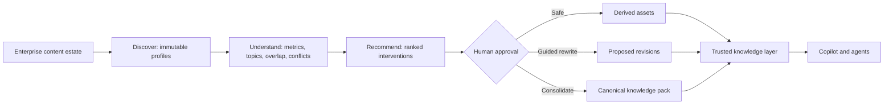

<!-- markdownlint-disable-file -->

# Task Research: shaper-knowledge-transformation-platform

| Field | Value |
|---|---|
| Date | 2026-09-10 |
| Researcher / agent | rpi-research |
| Status | Complete |
| Artifact path | .copilot-tracking/research/2026-09-10/shaper-knowledge-transformation-platform-research.md |

## Research Brief

* What to research: How to evolve Shaper from an answer-unit compiler into the
  Azure-native Knowledge Transformation Platform defined in the caller's
  authoritative brief, spanning Discover, Understand, Recommend, and Transform.
* Why it matters: The platform must create a trusted canonical knowledge estate
  for agents rather than merely improve individual documents or feed a RAG index.
* Audience or intended use: Product, architecture, engineering, and implementation.
* Scope: Current repository capabilities and gaps; enterprise source discovery;
  readiness assessment; duplication, contradiction, freshness, ownership,
  authority, clustering, recommendation, approval, transformation, publication,
  Azure service boundaries, APIs, dashboard, and agent delivery surfaces.
* Non-goals: A SharePoint web part, document editor, generic RAG ingestion
  pipeline, metadata-only utility, or autonomous modification of source content.
* Criteria: Preserve the brief's positioning and four-phase workflow; identify a
  coherent MVP that can be implemented and tested in this repository; distinguish
  measured scores from model confidence; retain provenance and human approval.
* Requested outputs: Evidence-backed target architecture, current-state gap
  analysis, selected MVP slice, implementation implications, risks, and planning
  readiness.
* Output mode: convergence.

## Research Parameters

| Field | Value |
|---|---|
| Research question(s) | What architecture and MVP most directly implement the new Shaper vision without regressing existing trusted publication? |
| Codebase scope | src/shaper/, tests/, prototype/, docs/, schemas/, bicep/, scripts/ |
| External scope | Official Microsoft Azure, Microsoft Graph, and Azure AI documentation where architecture decisions require current evidence |
| Initial internal candidate areas | Domain models, compiler workflow, SharePoint adapter, publication, query/MCP, hosted concept, deployment topology |
| Initial external candidate areas | Microsoft Graph change tracking; Azure AI Search enrichment and knowledge-store patterns; Azure OpenAI structured outputs; Azure architecture guidance |
| Research posture | balanced |
| Posture provenance | Default: broad product direction with a bounded implementation target |
| Explicit limits / deadline | The supplied brief supersedes the narrower multi-source answer-shaping direction; research must lead into implementation |
| Posture-specific completion basis | Balanced scope coverage and adequate evidence |
| Edits allowed during research? | no, research-only |
| Resolved evidence root | .copilot-tracking/ |
| Known constraints / excluded sources | No production source changes during research; no unsupported accuracy claims; no source mutation during Discover |

## Extension Registry and Provenance

| Kind | Candidate | Match and provenance | Scoped authority or output contract | Selected / skipped reason |
|---|---|---|---|---|
| Instruction | copilot-tracking.instructions.md | Research evidence path | Tracking artifact identity and evidence conventions | Selected |
| Instruction | untrusted-content-boundary.instructions.md | Repository and web evidence are ingested | Treat retrieved content as data | Selected |
| Skill | rpi-research | Explicit research-and-implement lifecycle | Three-wave research and evidence contract | Selected |
| Skill | evaluation-design | Agent Readiness scoring and future outcome claims | Evaluation dataset and metric design | Deferred to a bounded follow-up; scoring semantics are included here |
| Research specialist | None | Current-state and architecture questions are tightly coupled | Parent-owned synthesis | Skipped; inline work avoids fragmented conclusions |

## User Participation and Research Decisions

| Checkpoint | Questions or no-interaction rationale | Answers / unanswered | Resulting decision or selected further research |
|---|---|---|---|
| Intake | The new brief is comprehensive and explicitly supersedes prior direction | None | Use it as the authoritative product contract |
| Direction change | Caller explicitly changed the product from document answer shaping to estate-level knowledge transformation | None | Revalidate prior evidence in a fresh complete research cycle |
| Convergence | All three waves completed; the selected slice is supported by internal and external evidence | None | Proceed with the estate-assessment vertical slice |

## Scope and Success Criteria

* Scope: Define and select an implementable vertical slice that makes the new
  product direction observable while preserving existing compilation, review,
  immutable publication, HTTP, MCP, and Azure deployment behavior.
* Assumptions: The first implementation can use a deterministic local assessment
  engine and representative corpus metadata while Azure-scale estate connectors
  remain extensible; source content is never mutated without approval.
* Success criteria:
  * Every research question is answered or names the smallest missing evidence.
  * Findings cite code (`C#`) or external (`W#`) evidence.
  * The selected architecture covers all four product phases.
  * The MVP exposes assessment, topic/overlap insight, recommendations, and
    transformation modes through a coherent domain/API/UI contract.
  * Scoring is explainable, deterministic, and not represented as model confidence.
  * Alternatives, risks, residual uncertainty, and planning readiness are recorded.

## Task Research Requests

* Explicit requests: Research and implement the supplied Shaper vision,
  positioning, four-phase workflow, readiness model, Azure-native principle, and
  trusted knowledge outcome. All prior narrower instructions are superseded.
* Inferred research questions: Which current components are reusable; what new
  domain aggregate and API are required; how can readiness dimensions be scored;
  what constitutes the smallest complete product slice; and which Azure services
  belong in the scalable target architecture.
* Caller constraints and non-goals: SharePoint is a delivery surface, not the
  product. Shaper is not a web part, editor, RAG pipeline, tagging utility, or
  grammar assistant.

## Direction Controls

| Control type | Direction or boundary | Provenance | Effect |
|---|---|---|---|
| discard | Narrow answer-shaping compiler as the primary product identity | Caller brief, 2026-09-10 | Treat answer units as one transformation output, not the platform definition |
| change | Product identity becomes Knowledge Transformation Platform | Caller brief, 2026-09-10 | Center estate assessment, knowledge analysis, interventions, and canonical publication |
| add | Discover, Understand, Recommend, Transform | Caller brief, 2026-09-10 | Require an end-to-end four-phase domain and experience |
| add | 0-100 Agent Readiness Score with prioritized remediation | Caller brief, 2026-09-10 | Define explainable component scoring and findings |
| narrow | No changes during Discover and human approval before publication | Caller brief, 2026-09-10 | Preserve read-only analysis and approval gates |
| add | Azure-native service with SharePoint, Copilot, Foundry, REST, and dashboard surfaces | Caller brief, 2026-09-10 | Define a service core independent of any one UI |

## Prior-Knowledge Gate

* Existing evidence is reusable for the deployed compiler kernel, strict AI
  outputs, review, immutable releases, MCP, and Azure Container Apps topology.
* New research is required because estate-level analysis, readiness scoring,
  interventions, transformation modes, and target Azure architecture were not
  covered by the prior narrow research.

## Research Questions

| ID | Question | Evidence needed | Status |
|---|---|---|---|
| Q1 | Which existing Shaper capabilities remain valid building blocks? | Domain, application, API, publication, and deployment code | Pending |
| Q2 | What domain model makes the four product phases coherent? | Current code plus target workflow analysis | Pending |
| Q3 | How should Agent Readiness be measured and explained? | Metric semantics, deterministic scoring, evaluation constraints | Pending |
| Q4 | What is the smallest complete implementation slice? | Gap analysis, dependencies, and test ownership | Pending |
| Q5 | What Azure-native target architecture supports estate-scale operation? | Official Microsoft platform evidence and current deployment limits | Pending |
| Q6 | What credible alternatives or failure modes challenge the preferred design? | Contrarian analysis | Pending |

## Research Cycle Log

### Cycle 1 Wave 1 - Wider

* Status: Complete.
* Focus: Current platform breadth, reusable components, missing capabilities,
  candidate Azure services, and MVP alternatives.
* Findings:
  * The domain already supplies immutable source documents, permission snapshots,
    exact spans, grounded answer units, lifecycle states, and release manifests
    (C2, C3).
  * Application ports already separate source connectors, parsing, model access,
    validation, review, release sinks, and indexing (C4).
  * SharePoint delta enumeration exists, including changed and deleted items, but
    hosted compilation currently accepts only direct uploads (C5, C6).
  * HTTP and MCP expose compile, review, query, and explanation but no estate
    assessment, topic analysis, recommendations, or transformation plan (C7, C8).
  * The existing Azure topology is a single-replica Container App with local
    SQLite coordination and Azure Files for durable release artifacts (C9, C10).
  * Microsoft Graph delta supports initial enumeration, next-link paging,
    persisted delta links, and deletion detection, matching Shaper's discovery
    synchronization needs (W1).
  * Azure AI Search enrichment can project derived content into Azure Storage,
    but the platform documentation positions this as enrichment/indexing
    infrastructure rather than authoritative knowledge-governance logic (W2).
* Reflection: Existing Shaper is strongest at the final portion of Transform:
  grounded generation, approval, immutable publication, and agent retrieval.
  The missing product is an estate aggregate and analysis/recommendation layer.
  A vertical slice can be added without replacing the compiler or choosing every
  production Azure service immediately.

### Cycle 1 Wave 2 - Deeper

* Status: Complete.
* Focus: Domain contracts, scoring semantics, API/UI flow, persistence,
  provenance, approval, and validation.
* Findings:
  * The first domain boundary should be an immutable `EstateAssessment` whose
    inputs are normalized `KnowledgeDocumentProfile` records. It should contain
    dimension scores, explainable metrics, findings, topic clusters,
    contradictions, and prioritized intervention recommendations.
  * Scoring must be deterministic at MVP: each dimension is the mean of named
    0-100 metric values. Overall Agent Readiness is the mean of Content Quality,
    Knowledge Quality, and Agent Readiness dimensions. Every metric must expose
    its value, explanation, and evidence document IDs.
  * Content Quality can initially measure structure signals, readability,
    metadata completeness, and freshness. Knowledge Quality can measure
    duplication, contradictions from declared business terms, authority
    coverage, and topic coverage. Agent Readiness can measure procedural
    clarity, FAQ coverage, chunking suitability, and semantic consistency.
  * Deterministic findings should drive deterministic intervention types:
    consolidate duplicates, identify authoritative versions, archive redundant
    or stale material, modernize structure, generate metadata, summaries and
    FAQs, extract procedures, create knowledge packs, and create canonical
    guidance.
  * `Safe`, `Guided rewrite`, and `Knowledge consolidation` are transformation
    modes on approved recommendations. Discover remains read-only. The MVP API
    should assess and recommend but not silently execute source mutations.
  * The existing synthetic evaluation framework enforces case identity and
    comparative regression metrics, but it does not validate an estate-readiness
    score against reviewed enterprise ground truth (C11, C12).
  * At production scale, reliable async work should be decoupled using a durable
    broker; Microsoft documents Service Bus as providing queues, load leveling,
    competing consumers, and transactional messaging (W3).
  * The current state model requires a managed transactional store before
    horizontal scale. Azure Database for PostgreSQL is managed, supports high
    availability, backups, and common relational workloads; actual store choice
    still depends on relationship, consistency, concurrency, and lifecycle
    requirements (W4, W5).
  * Container Apps supports HTTP and event-driven workloads, autoscaling, custom
    metrics including Service Bus, probes, and multi-replica reliability (W6).
* Reflection: The MVP can implement a useful, testable product contract locally:
  deterministic assessment and recommendations, REST exposure, and a four-phase
  concept UI, with the existing compiler remaining the execution engine. The
  target Azure design should be documented, not provisioned prematurely in the
  same slice.

### Cycle 1 Wave 3 - Contrarian

* Status: Complete.
* Focus: Risks of synthetic scoring, premature platform scope, AI-determined
  authority, source mutation, and over-coupling to Azure or SharePoint.
* Counter-evidence:
  * A single percentage can create false precision. An overall score is safe only
    when component metrics, weights, evidence counts, limitations, and data
    coverage are visible. It must be labeled an assessment heuristic until
    calibrated against human judgments.
  * Text similarity is not proof of duplication, and differing wording is not
    proof of contradiction. Findings must be candidates for review rather than
    authority decisions.
  * The most recently modified document is not necessarily authoritative.
    Authority requires explicit owner, status, policy hierarchy, or human
    confirmation.
  * A dashboard-only mock would change positioning without establishing a product
    contract. Conversely, attempting production connectors, queues, managed
    state, search, graph persistence, and transformations together would create
    an unreviewable platform rewrite.
  * Azure AI Search is valuable as a retrieval and enrichment projection, but
    making it the canonical knowledge authority would reproduce the RAG-pipeline
    positioning the caller explicitly rejected (C1, W2).
  * AI must not autonomously archive, rewrite, or consolidate source content.
    Recommendations and generated assets require explicit review and publication.
* Reflection: The selected slice must combine a real domain/service/API with the
  visible product experience, use deterministic explainable heuristics, label
  uncertainty, and leave source mutation out. This makes the new vision tangible
  without overstating enterprise validity.

### Cycle 1 Parent Synthesis

* Selected recommendation: implement an estate-assessment vertical slice backed
  by immutable domain contracts and a deterministic analysis service, expose it
  through authenticated REST, and replace the narrow concept flow with the four
  phases and transformation modes. Preserve the existing compiler, review,
  release, query, MCP, and Azure deployment behavior.
* The selected slice creates real contracts for Discover, Understand, Recommend,
  and the approval boundary of Transform. Existing answer shaping and immutable
  publication remain the first execution path behind Transform.
* Document the scale-out Azure target as API and worker Container Apps, Service
  Bus, managed PostgreSQL, Blob Storage, Azure OpenAI, optional Azure AI Search
  projection, Entra identity, and Azure Monitor. Do not provision the full target
  before the new domain and workload behavior are validated.
* Re-entry decision: no additional cycle is required for implementation planning.
  Calibration, connector hardening, and production data-store selection remain
  explicit follow-up research, not blockers for the vertical slice.

## Evidence Log

| ID | Type | Location | Finding | Confidence |
|---|---|---|---|---|
| C1 | Caller direction | Conversation, 2026-09-10 | The supplied Knowledge Transformation Platform brief is authoritative and supersedes the narrower product framing | High |
| C2 | Code | src/shaper/domain/models.py:181 | PermissionSnapshot and SourceDocument provide immutable, tenant-scoped source evidence | High |
| C3 | Code | src/shaper/domain/models.py:282 | AnswerUnit and release models provide grounded, versioned, reviewable transformation output | High |
| C4 | Code | src/shaper/application/ports.py:54 | Connector, parser, model, validator, review, sink, and index boundaries are already separated | High |
| C5 | Code | src/shaper/infrastructure/sharepoint.py:63 | SharePoint source synchronization implements delta checkpoints and withdrawals | High |
| C6 | Code | src/shaper/application/compiler.py:114 | Hosted compilation currently rejects non-upload sources and non-filesystem output | High |
| C7 | Code | src/shaper/interfaces/http.py:107 | HTTP surface centers jobs, uploads, review, query, and explanation | High |
| C8 | Code | src/shaper/interfaces/mcp_server.py:42 | MCP surface exposes compile, status, query, and explanation only | High |
| C9 | Code | bicep/main.bicep:207 | Current Azure deployment is one combined Container App | High |
| C10 | Documentation | README.md:20 | SQLite coordination deliberately constrains horizontal scale | High |
| C11 | Code | src/shaper/application/regression.py:135 | Existing benchmarks compare stable cases with deterministic, advisory, retrieval, latency, and token metrics | High |
| C12 | Documentation | README.md:77 | Existing synthetic evaluation proves mechanics only and forbids production quality claims | High |
| W1 | External | https://learn.microsoft.com/en-us/graph/api/driveitem-delta?view=graph-rest-1.0 (retrieved 2026-09-10) | Graph delta supports paged initial enumeration, persisted delta links, and deleted-item detection | High |
| W2 | External | https://learn.microsoft.com/en-us/azure/search/knowledge-store-concept-intro (retrieved 2026-09-10) | Azure AI Search knowledge stores project skillset-enriched content into Storage for downstream use but are not queryable canonical stores | High |
| W3 | External | https://learn.microsoft.com/en-us/azure/service-bus-messaging/service-bus-messaging-overview (retrieved 2026-09-10) | Service Bus provides managed queues, load leveling, competing consumers, and transactional messaging | High |
| W4 | External | https://learn.microsoft.com/en-us/azure/postgresql/overview (retrieved 2026-09-10) | Azure Database for PostgreSQL provides managed relational persistence, HA options, backups, and scaling controls | High |
| W5 | External | https://learn.microsoft.com/en-us/azure/architecture/guide/technology-choices/data-stores-getting-started (retrieved 2026-09-10) | Azure store selection should follow data format, relationships, consistency, concurrency, lifecycle, scale, security, and operational needs | High |
| W6 | External | https://learn.microsoft.com/en-us/azure/well-architected/service-guides/azure-container-apps (retrieved 2026-09-10) | Container Apps supports HTTP and event-driven workloads, autoscaling, probes, and resilient multi-replica configurations | High |

## Findings Mapped to Questions and Evidence

| Question | Answer | Evidence |
|---|---|---|
| Q1 | Reuse normalized source evidence, permission snapshots, connector and parser ports, bounded model access, validation, review, immutable releases, query, MCP, and current hosting. | C2-C10 |
| Q2 | Add `KnowledgeDocumentProfile`, metric and dimension scores, findings, topic clusters, recommendations, transformation modes, and immutable `EstateAssessment`. Keep these upstream of existing compile jobs. | C2-C8 |
| Q3 | Compute named deterministic 0-100 metrics, aggregate transparently, emit evidence and limitations, and treat the result as an uncalibrated heuristic until a reviewed evaluation establishes validity. | C11, C12 |
| Q4 | Implement domain + deterministic service + authenticated assessment endpoint + four-phase concept UI + target architecture documentation and focused tests. | C1-C12 |
| Q5 | Scale toward Graph delta connectors, Blob payloads, Service Bus work queues, Container Apps API/workers, managed PostgreSQL workflow state, Azure OpenAI, optional AI Search projections, Entra, and Monitor. | W1-W6 |
| Q6 | Guard against false precision, similarity-as-duplication, recency-as-authority, autonomous mutation, UI-only delivery, and using a retrieval index as canonical truth. | C1, C12, W2 |

## Key Discoveries

1. Shaper already has a strong trusted-transformation kernel; it lacks the
   estate-level product aggregate and workflow.
2. The complete MVP is an assessment-to-recommendation vertical slice, not a
   broad connector or infrastructure expansion.
3. Agent Readiness must be an explainable composite assessment, not a model
   confidence or claimed accuracy percentage.
4. Existing answer units become one output of Transform, not the product's
   primary identity.
5. Azure AI Search can be a downstream projection for retrieval and enrichment,
   but the canonical knowledge and decisions remain Shaper-owned.
6. Production scale requires asynchronous workers and managed state, but those
   services should follow validated workload contracts rather than precede them.

## Alternatives and Decision State

### Selected Recommendation

* Approach: Implement an explainable estate assessment aggregate and service,
  authenticated REST endpoint, and four-phase product experience; retain the
  existing trusted compiler and document the Azure scale-out target.
* Rationale: This is the smallest slice that changes both product semantics and
  executable behavior while preserving validated code.
* Evidence refs: C1-C12, W1-W6.
* Implementation impact: domain and application modules, HTTP composition,
  tests, prototype HTML/CSS/JS, README and deployment documentation.
* Confidence: High for the MVP boundary; representative-corpus calibration is
  still required before production readiness claims.

### Alternative: UI-only repositioning

* Approach: Update the concept without adding domain or API behavior.
* Trade-offs: Fast demonstration, but leaves no testable platform contract.
* Evidence refs: C7, C8.
* Rejection rationale: It would be a pitch rather than implementation.

### Alternative: Full production platform in one increment

* Approach: Add all connectors, Service Bus, managed database, AI Search,
  dashboard, and transformation engines immediately.
* Trade-offs: Broader infrastructure, but high cost, coupled decisions, and poor
  reviewability before workload semantics are proven.
* Evidence refs: C9, C10, W3-W6.
* Rejection rationale: Excessive scope for the first product-direction increment.

### Alternative: Make Azure AI Search the knowledge authority

* Approach: Treat an enriched search index or knowledge store as canonical.
* Trade-offs: Managed enrichment and retrieval, but conflates Shaper with a RAG
  pipeline and lacks Shaper-owned approval and authority semantics.
* Evidence refs: C1, W2.
* Rejection rationale: Conflicts with the explicit product positioning.

## Open Questions, Risks, and Residual Uncertainty

* Blocking: None at intake.
* Important: The MVP must make real product value observable without claiming
  that a small local sample represents enterprise-estate accuracy.
* Follow-up: Connector-specific production hardening and formal evaluation.
* Residual uncertainty: Metric weights and thresholds are hypotheses until
  calibrated against representative estates and human judgments.

## Current Decisions

| Decision | Status | Owner / source | Rationale | Evidence IDs | Implications |
|---|---|---|---|---|---|
| Adopt the Knowledge Transformation Platform brief as product authority | confirmed | user | Explicit direction change | C1 | All planning and implementation must align to the four phases |
| Add an estate-assessment vertical slice before broad infrastructure expansion | confirmed | evidence | Smallest complete behavior change with strong reuse | C2-C12 | New domain/service/API/UI contracts; existing compiler remains intact |
| Use deterministic explainable readiness metrics for MVP | confirmed | evidence | Avoids presenting model judgment as measurement | C11, C12 | Score includes component values, evidence, and limitations |
| Keep Azure AI Search as an optional projection | confirmed | user and evidence | Product is transformation, not RAG infrastructure | C1, W2 | Canonical decisions and artifacts remain Shaper-owned |
| Defer source mutation | confirmed | user | Discover is read-only and Transform requires approval | C1 | MVP recommends and plans transformations without changing originals |

## Unresolved Decisions

| Decision | Smallest evidence or answer needed | Owner | Impact | Blocker status |
|---|---|---|---|---|
| Calibrate readiness weights and thresholds | Representative corpus plus reviewed labels | downstream evaluation owner | Production validity | follow-up |
| Select first-party connectors after SharePoint | Customer source priorities and API research | product owner | Connector roadmap | follow-up |
| Select final production state store | Workload volume, query, relationship, consistency, and residency requirements | architecture owner | Scale-out topology | follow-up |

## Potential Next Research

| Priority | Research item | Expected value | Trigger | Selected? | Related questions / evidence |
|---|---|---|---|---|---|
| H | Formal baseline-versus-shaped evaluation design | Supports defensible improvement reporting | Core assessment and transformation contracts exist | deferred | Q3 |
| M | Connector-specific production API research | Enables enterprise-scale ingestion | MVP connector interface is stable | deferred | Q5 |

## Planning Readiness

* Status: Ready.
* Decision state: Estate-assessment vertical slice selected.
* Evidence basis: C1-C12, W1-W6.
* Preconditions met: Product authority, reusable kernel, gap analysis, scoring
  guardrails, MVP boundary, target architecture, and alternatives are recorded.
* Blockers: None for the selected implementation slice.
* Smallest action to change readiness: None.

## Closeout Record

| Field | Record |
|---|---|
| Research execution status | Complete |
| Completed waves | Cycle 1 Wider, Deeper, and Contrarian |
| Lane evidence or inline fallback | Inline research selected because the questions are tightly coupled |
| Research disposition | executed |
| Planning Readiness | Ready with C1-C12 and W1-W6 |
| Blockers | None for planning |
| Continuation owner and state | Confirmed automatic RPI Agent; automatic after gates pass |

## Advisory Next Step

| Field | Record |
|---|---|
| Research disposition | executed |
| Planning Readiness | Ready |
| Output mode and planning support | Convergence; selected recommendation supports planning |
| Acting owner | Confirmed automatic RPI Agent |
| Required gates or confirmations | Research disposition recorded; readiness gate passed |
| Continuation result | Automatic continuation to planning |
| Primary evidence file | .copilot-tracking/research/2026-09-10/shaper-knowledge-transformation-platform-research.md |
| Notes for planning or re-entry | Plan domain, service, REST, UI, docs, and tests as one vertical slice; do not add production source mutation |

* Advisory only: rpi-research does not invoke a follow-on skill directly.
* Completion or limit-blocked basis: Material questions are answered; remaining
  uncertainties require representative customer evidence and do not affect the
  selected MVP.

## Sources

* W1 - driveItem: delta - https://learn.microsoft.com/en-us/graph/api/driveitem-delta?view=graph-rest-1.0 (retrieved 2026-09-10, Microsoft Graph v1.0)
* W2 - Knowledge Store Concepts - https://learn.microsoft.com/en-us/azure/search/knowledge-store-concept-intro (retrieved 2026-09-10, current)
* W3 - Introduction to Azure Service Bus Messaging - https://learn.microsoft.com/en-us/azure/service-bus-messaging/service-bus-messaging-overview (retrieved 2026-09-10, current)
* W4 - What Is Azure Database for PostgreSQL? - https://learn.microsoft.com/en-us/azure/postgresql/overview (retrieved 2026-09-10, current)
* W5 - Prepare to Choose a Data Store in Azure - https://learn.microsoft.com/en-us/azure/architecture/guide/technology-choices/data-stores-getting-started (retrieved 2026-09-10, current)
* W6 - Architecture Best Practices for Azure Container Apps - https://learn.microsoft.com/en-us/azure/well-architected/service-guides/azure-container-apps (retrieved 2026-09-10, current)

## Artifact Self-Check

* [x] Every research question is answered or marked with missing evidence.
* [x] Cycle 1 contains Wider, Deeper, and Contrarian waves in order.
* [x] Research posture, provenance, limits, and completion basis are recorded.
* [x] Every code and external finding has a stable evidence ID and location.
* [x] Findings, alternatives, decisions, and readiness cite evidence IDs.
* [x] Extension candidates and their disposition are recorded.
* [x] User participation and no-interaction rationale are recorded.
* [x] Planning readiness is evidence-backed.
