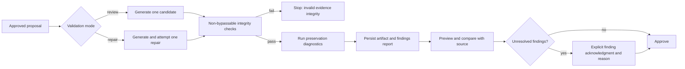

<!-- markdownlint-disable-file -->

# Task Research: optional-post-shaping-validation

| Field              | Value |
|--------------------|-------|
| Date               | 2026-09-16 |
| Researcher / agent | rpi-research |
| Status             | Complete |
| Artifact path      | .copilot-tracking/research/2026-09-16/optional-post-shaping-validation-research.md |

## Research Brief

* What to research: Why the post-shaping deterministic-check checkbox does not govern whether deterministic findings block transformation, and what replacement control model lets users reshape documents without removing independent safety.
* Why it matters: Deterministic false positives currently block all practical use, despite an explicit user choice that appears to disable those checks.
* Audience or intended use: Product and engineering planning for the next implementation.
* Scope: Browser checkbox state, HTTP request contract, transformation proposal and run models, shaping orchestration, deterministic validation, artifact review, publication authorization, tests, and current operational evidence.
* Non-goals: Implementing a fix, removing source-grounding controls without replacement, changing assessment findings, or researching unrelated upload and Azure capacity behavior.
* Criteria: The proposed direction must honor the user control, preserve fail-closed grounding for publication, distinguish generation from publication, remain auditable, and have testable contracts.
* Requested outputs: Evidence-backed research, alternative comparison, and a planning-ready recommended direction.
* Output mode: convergence.

## Research Parameters

| Field                            | Value |
|----------------------------------|-------|
| Research question(s)             | Where is the checkbox authority lost, which checks should govern generation versus publication, and what control model best restores usable reshaping without silent policy risk? |
| Codebase scope                   | prototype/copilot-studio-knowledge-compiler; src/shaper/application; src/shaper/domain; src/shaper/interfaces; tests; docs |
| External scope                   | none |
| Initial internal candidate areas | app.js transformation submission; HTTP transformation request; EstateTransformationService; ShapingLoop; DeterministicValidator; review and publication services |
| Initial external candidate areas | none |
| Research posture                 | focused |
| Posture provenance               | default for a bounded internal failure with named runtime evidence |
| Explicit limits / deadline       | none |
| Posture-specific completion basis | focused scope and materiality |
| Edits allowed during research?   | no, research-only |
| Resolved evidence root           | .copilot-tracking/research/ |
| Known constraints / excluded sources | Code-only research; no source changes; no weakening of approved-exclusion authority or publication authorization |

## Extension Registry and Provenance

| Kind | Candidate | Match and provenance | Scoped authority or output contract | Selected / skipped reason |
|------|-----------|----------------------|-------------------------------------|---------------------------|
| Instruction | copilot-tracking.instructions.md | Applies to .copilot-tracking/research/** | Evidence location and artifact conventions | Selected |
| Skill | rpi-research | Explicit user request to research | Three-wave evidence and convergence contract | Selected |
| Skill | python-foundational | Python code is in research scope | Readability and architectural-fit criteria only | Selected earlier; no implementation |
| Research specialist | none | The code path is bounded and tightly coupled | None | Skipped because direct tracing is faster and avoids duplicated scope |

## User Participation and Research Decisions

| Checkpoint | Questions or no-interaction rationale | Answers / unanswered | Resulting decision or selected further research |
|------------|----------------------------------------|----------------------|------------------------------------------------|
| Intake | No question needed: the user explicitly reports both the blocking failure and the broken checkbox. | None | Research the complete authority path and compare control models. |
| Direction change | Runtime evidence changed the focus from calibrating individual regexes to redesigning optional validation authority. | User explicitly requested a new approach. | Treat checkbox enforcement as the primary issue; individual false positives are evidence, not the sole target. |
| Convergence | No further question needed: the code establishes the authority defect and supports a bounded replacement. | None | Select advisory-first generation with non-bypassable integrity checks and explicit human exception approval. |

## Scope and Success Criteria

* Scope: Trace the control end to end and identify a design that separates candidate generation, deterministic review, and publication gates.
* Assumptions: The checkbox is intended to affect post-shaping deterministic validation; this must be verified in code rather than trusted from its label.
* Success criteria:
  * Every research question is answered or marked with the smallest missing evidence.
  * All findings cite stable code evidence IDs and workspace-relative path:line locations.
  * At least three viable control models are compared.
  * The selected recommendation preserves publication safety while preventing advisory checks from blocking candidate creation.
  * Planning readiness and residual risks are explicit.

## Task Research Requests

* Explicit requests: Research why deterministic checks still force failure, account for the non-working checkbox, and plan a new approach.
* Inferred research questions: Whether the checkbox is omitted from the request, ignored by the server, or overridden by an unconditional validator; whether validation can be deferred to artifact review; and which invariants must remain mandatory.
* Caller constraints and non-goals: Research-only during this phase; produce planning-ready evidence, not source changes.

## Direction Controls

| Control type | Direction or boundary | Source / checkpoint | Effect on active brief, evidence, or revalidation |
|--------------|-----------------------|---------------------|---------------------------------------------------|
| change | Replace repeated per-regex calibration with an authority and lifecycle redesign. | User, 2026-09-16 | Requires a complete cycle across UI, API, orchestration, review, and publication. |
| narrow | Focus on post-shaping deterministic checks and their checkbox. | User, 2026-09-16 | Excludes unrelated provider capacity and upload work. |
| exclude | Do not remove source-grounding and publication safety without a replacement control. | Existing product safety contract | Alternatives must preserve an independent publication boundary. |

## Research Questions

| # | Sub-question | Type | Priority | Status |
|---:|--------------|------|----------|--------|
| Q1 | What does the checkbox currently control, and where is that choice lost? | depth | H | answered |
| Q2 | Which deterministic findings are exact safety invariants versus representation-sensitive diagnostics? | depth | H | answered |
| Q3 | At what lifecycle stage should each class block: generation, review, approval, or publication? | depth | H | answered |
| Q4 | Which replacement control model best restores usable reshaping while preserving auditability and publication safety? | breadth | H | answered |
| Q5 | What tests, data-model changes, API changes, UI states, and documentation are required for implementation? | straightforward | M | answered |

## Prior Knowledge Gate

* Existing artifacts reviewed: Prior conversation evidence and the deployed validator-calibration behavior at commit 4bf741f.
* Reused (verified) findings: Azure OpenAI requests now succeed; the reported failure is emitted after targeted repair by deterministic preservation checks.
* Superseded / stale: The hypothesis that provider capacity is the active blocker is superseded for this document because all shaping calls returned HTTP 200.

## Research Cycle Log

### Cycle 1

* Active direction controls: change, narrow, exclude.
* Active research posture and completion basis: focused; focused scope and materiality.
* Explicit limits or deadline effect: none.

#### Wave 1: Wider

* Plan and independent lanes: Trace UI, API, domain, orchestration, validator, review, publication, tests, and documentation.
* Worker evidence relationships or inline fallback: Inline because this is one tightly coupled authority chain.
* Reflection: The checkbox is named `generateEvaluations`, persists the estate's `generate_evaluations` flag, and sends only recommendation IDs to the transformation endpoint. The server request has no validation-mode field. The checkbox changes only the optional score-based evaluator and a client-side progress label; it has no authority over candidate validation. Evidence C1-C6.

#### Wave 2: Deeper

* Parent-prioritized material from Wave 1: Identify the unconditional rejection points, review-state behavior, persistence gaps, and publication authority.
* Plan and independent lanes: Trace the two validator invocations, finding severity transitions, artifact creation, review records, artifact approval, and domain persistence.
* Worker evidence relationships or inline fallback: Inline; evidence C7-C13.
* Reflection: The validator runs inside `ShapingLoop`, where any blocking finding causes repair and then a terminal exception. It runs again after an accepted outcome. A failed candidate never reaches artifact review. If blocking findings were merely allowed through, `ReviewService` would quarantine the unit and prevent approval. Findings are not stored in `ReviewRecord` or `KnowledgeArtifact`, while the browser's approval uses a hard-coded generic reason. A usable override therefore needs a persisted validation report and an explicit review decision, not only a severity change.

#### Wave 3: Contrarian

* In-scope challenge targets and boundaries: Challenge full bypass, blanket warning conversion, publication-only gating, continued regex calibration, and staged validation modes.
* Plan and independent lanes: Compare each alternative against usability, integrity, auditability, and implementation fit.
* Worker evidence relationships or inline fallback: Inline; C7-C14.
* Reflection: A full bypass or blanket warning conversion would also bypass source identity, citation existence, and approved-exclusion controls. Keeping all existing blockers at publication would move rather than solve false-positive blocking. Continued calibration cannot make lexical association checks authoritative for arbitrary prose. The surviving design separates non-bypassable integrity checks from reviewable preservation diagnostics, persists both, and requires explicit human acknowledgment before publishing a diagnostic exception.

#### Parent Synthesis and Disposition

| Material / claim | Evidence IDs or worker pointers | Parent disposition | Evidence-based rationale | Primary-artifact treatment |
|------------------|---------------------------------|--------------------|--------------------------|----------------------------|
| The checkbox does not control validation. | C1-C6 | accepted | UI state, API schema, and server execution agree. | Root-cause finding |
| All current blocking findings should become optional. | C7-C10 | rejected | This would include source identity, evidence existence, and exclusion-authority safeguards. | Rejected alternative |
| Preservation diagnostics should not prevent artifact generation. | C7-C9, C11-C14 | accepted | They are representation-sensitive and currently prevent review, while the existing review model can be extended to govern exceptions. | Selected lifecycle direction |
| Human approval can remain unchanged. | C11-C13 | rejected | Findings are not persisted and the current browser sends a fixed reason, so no informed exception is recorded. | Required plan scope |

#### Cycle Re-entry Evaluation

* Another complete three-wave cycle needed: no.
* Trigger or stop basis: Focused scope is covered, the root cause is direct, alternatives are distinguishable, and additional regex examples would not change the authority design.
* Revised brief or revalidation required: none.
* Readiness effect: Ready for planning.

## Evidence Log

* Delegation: inline; bounded tightly coupled code path.

### Codebase Evidence

| ID | Claim / finding | Location (`path:line`) | Tool | Confidence | Notes |
|----|-----------------|------------------------|------|------------|-------|
| C1 | The checkbox is labelled as running deterministic quality checks but its element is named `generateEvaluations`. | prototype/copilot-studio-knowledge-compiler/index.html:512 | read | high | The visible intent and internal state name conflict. |
| C2 | The checkbox is initialized from the estate-wide `generate_evaluations` setting. | prototype/copilot-studio-knowledge-compiler/app.js:1579 | read | high | It is not a per-run validation choice. |
| C3 | Toggling the checkbox updates only `generate_evaluations` on the estate. | prototype/copilot-studio-knowledge-compiler/app.js:2953 | read | high | No validation mode is recorded. |
| C4 | The streamed transformation request sends only `{ ids }`. | prototype/copilot-studio-knowledge-compiler/app.js:569 | read | high | The user choice cannot reach transformation execution. |
| C5 | Both transformation endpoints accept `SelectionRequest`, which contains only recommendation IDs. | src/shaper/interfaces/http.py:179 | read/usages | high | The API has no validation policy contract. |
| C6 | `generate_evaluations` controls only the optional score-based artifact evaluator after candidate validation. | src/shaper/application/artifacts.py:706 | read | high | The progress UI's skipped quality state does not mean preservation checks were skipped. |
| C7 | `ShapingLoop` invokes the validator unconditionally for every candidate. | src/shaper/application/shaping.py:317 | read | high | Blocking findings trigger repair regardless of the checkbox. |
| C8 | Repeated or second-candidate blocking findings raise `ShapingValidationError`. | src/shaper/application/shaping.py:327 | read | high | The candidate is discarded before artifact review. |
| C9 | The transformation service invokes the same validator again after the shaping loop returns. | src/shaper/application/artifacts.py:664 | read | high | Validation is duplicated and still unconditional. |
| C10 | The validator mixes exact evidence-integrity checks with representation-sensitive preservation association checks under the same blocking severity. | src/shaper/application/validation.py:206 | read | high | Source identity and missing spans coexist with numeric, clause, modal, and qualifier heuristics. |
| C11 | Any blocking finding quarantines the review unit, and only an in-review unit can be approved. | src/shaper/application/review.py:114 | read | high | Simply allowing the candidate through without a new policy still blocks publication. |
| C12 | `ReviewRecord` persists the unit and decisions but not validation findings. | src/shaper/application/review.py:36 | read | high | A reviewer cannot make an auditable finding-specific exception. |
| C13 | Browser approval sends a fixed reason and hard-coded review revision rather than an explicit finding acknowledgment. | prototype/copilot-studio-knowledge-compiler/app.js:3008 | read | high | Current approval is not an informed override path. |
| C14 | The artifact model stores a score-based optional evaluation but no findings-led validation report. | src/shaper/domain/estate.py:526 | read | high | This conflicts with the findings-led product direction and cannot explain individual impact. |

### External Evidence

No external evidence used.

### Contradictions / Conflicts

* Product documentation calls deterministic quality checks optional, while architecture documentation states that numeric, identifier, duty, permission, prohibition, and qualifier findings remain blocking. Code resolves the conflict in favor of unconditional blocking. Evidence C1-C10.

## Findings Mapped to Questions and Evidence

| Question | Finding | Evidence IDs | Confidence | Decision or readiness implication |
|----------|---------|--------------|------------|-----------------------------------|
| Q1 | The checkbox only toggles estate evaluation generation; no per-run validation choice reaches the server. | C1-C6 | high | Replace the misleading setting with an explicit run-level validation mode. |
| Q2 | Exact integrity checks and heuristic preservation diagnostics currently share one blocking channel. | C7-C10 | high | Define separate rule classes and enforcement semantics. |
| Q3 | Integrity checks belong before artifact creation; preservation diagnostics belong on the generated artifact and its review decision. | C7-C13 | high | Generation must produce a reviewable candidate unless integrity itself is invalid. |
| Q4 | Advisory-first generation with optional repair and explicit finding acknowledgment best meets usability and safety criteria. | C7-C14 | high | Selected for planning. |
| Q5 | Implementation spans domain contracts, API, shaping orchestration, persistence, approval, UI, tests, schema, and documentation. | C1-C14 | high | Planning is ready and must be cross-surface. |

## Key Discoveries

* The current checkbox is not broken at the DOM level; it is attached to the wrong domain concept.
* The system has three conflated concepts: validation used for candidate repair, validation used for publication governance, and optional score-based evaluation.
* A successful replacement should always create a previewable artifact when the candidate schema and evidence identity are valid, even if preservation diagnostics remain.
* Human approval must record which diagnostics were accepted and why; otherwise making checks optional creates an unaudited bypass.
* The remaining score-based `TransformationEvaluation` should be replaced by findings-led output because it revives the score-out-of-100 model the product was meant to remove.

## Alternatives and Decision State

### Selected Recommendation

* Approach: Introduce a run-level `validation_mode` with `review` as the default and `repair` as the optional choice. Always enforce candidate schema, source/version identity, cited-span existence, and approved-exclusion authority. In `repair` mode, use preservation diagnostics for one targeted repair, but retain the best valid candidate if diagnostics remain. Run preservation diagnostics once on the retained candidate, persist a findings-led `ArtifactValidationReport`, and create a previewable artifact in `needs_review`. Publishing an artifact with unresolved reviewable findings requires a reviewer to acknowledge the exact finding IDs and enter an exception reason. Remove the score-based evaluator and relabel the checkbox to “Try one automatic repair from preservation findings.”
* Rationale: This makes the user control real, prevents heuristic false positives from destroying the candidate, keeps evidence-integrity failures non-bypassable, and creates an auditable human decision at the actual publication boundary.
* Evidence refs: C1-C14.
* Implementation impact: Domain schema and persistence for validation mode/report; transformation API; shaping loop terminal outcome; artifact state and approval request; browser control, progress, findings panel, and approval dialog; regression tests; architecture, feature, deployment, and operations documentation.
* Confidence: high; implementation tests must prove integrity rules remain non-bypassable and reviewable findings cannot publish without exact acknowledgment.

### Alternative: Full checkbox bypass

* Approach: Skip all deterministic validation when unchecked.
* Trade-offs: Fast and simple, but source identity, citation, and exclusion-authority failures could reach publication.
* Evidence refs: C7-C11.
* Rejection rationale: It weakens non-bypassable integrity and provides no audit trail.

### Alternative: Convert every blocker to a warning

* Approach: Keep validation but globally downgrade blocking severity.
* Trade-offs: Produces artifacts, but collapses exact integrity failures and heuristic diagnostics into the same non-enforcing class.
* Evidence refs: C10-C12.
* Rejection rationale: It cannot distinguish an invalid evidence chain from a possible preservation concern.

### Alternative: Move all current blockers to publication

* Approach: Generate artifacts but preserve every existing deterministic finding as a publication blocker.
* Trade-offs: Improves preview access but still blocks all usage on the same false positives.
* Evidence refs: C8-C13.
* Rejection rationale: It moves the failure later without creating a human exception path.

### Alternative: Continue calibrating individual regexes

* Approach: Keep the existing lifecycle and add more exclusions or matching logic.
* Trade-offs: Low schema impact, but arbitrary document language continually produces new association edge cases.
* Evidence refs: C7-C10.
* Rejection rationale: The failure is now authority and lifecycle design, not one missing lexical exception.

## Open Questions, Risks, and Residual Uncertainty

* Blocking: None for planning.
* Important: Planning must enumerate the exact non-bypassable rule IDs and define migration behavior for existing artifacts and review records.
* Follow-up: Decide whether `repair` remains opt-in or becomes the default after measuring repair usefulness; this does not block the initial review-default design.
* Residual uncertainty: The best-candidate selection policy needs implementation-time tests when both initial and repaired candidates have different diagnostic sets.

## Current Decisions

| Decision | Status | Owner / source | Rationale | Evidence IDs | Implications |
|----------|--------|----------------|-----------|--------------|--------------|
| Research the lifecycle control model rather than another isolated regex patch. | confirmed | user | Existing calibration still blocks all use and the checkbox does not work. | C1 | Planning must address control authority and lifecycle stages. |
| Separate non-bypassable integrity from reviewable preservation diagnostics. | proposed | evidence | The validator currently conflates rules with different certainty and risk. | C7-C12 | Requires explicit rule classification. |
| Make artifact generation advisory-first and publication exception-aware. | proposed | evidence | Users need a previewable result, while publication still needs accountable review. | C8-C14 | Requires persisted findings and explicit acknowledgment. |
| Remove score-based transformation evaluation. | proposed | user direction and evidence | The optional evaluator still emits scores out of 100 and does not preserve finding detail. | C6, C14 | Replace with a findings-led validation report. |

## Unresolved Decisions

| Decision | Smallest evidence or answer needed | Owner | Impact | Blocker status |
|----------|------------------------------------|-------|--------|----------------|
| Choose whether automatic repair is opt-in or default after the initial release. | Product preference or measured repair success rate. | downstream plan/product | Affects checkbox default only. | follow-up |
| Define the exact integrity rule allowlist. | Map validator rule IDs to evidence-integrity versus preservation classes. | downstream plan/engineering | Determines non-bypassable behavior. | important |

## Potential Next Research

| Priority | Research item | Expected value | Trigger | Selected? | Related questions / evidence |
|----------|---------------|----------------|---------|-----------|------------------------------|
| M | Measure whether repaired candidates reduce diagnostics relative to initial candidates. | Informs the future default for `repair` mode. | Post-implementation telemetry. | deferred | Q4; C7-C9 |

## Planning Readiness

* Status: Ready.
* Decision state: Advisory-first artifact generation with non-bypassable integrity and explicit publication exception selected.
* Evidence basis: C1-C14.
* Preconditions met: Root cause, lifecycle boundaries, persistence gap, approval gap, alternatives, and cross-surface impact are identified.
* Blockers: None for planning.
* Smallest action to change readiness: None.

## Closeout Record

| Field | Record |
|-------|--------|
| Research execution status | Complete |
| Completed waves | Cycle 1 Wider, Deeper, and Contrarian |
| Lane evidence or inline fallback | Inline bounded code trace |
| Research disposition | executed |
| Planning Readiness | Ready; C1-C14 |
| Blockers | None |
| Continuation owner and state | user; advisory `/rpi-plan` |

## Advisory Next Step

| Field | Record |
|-------|--------|
| Research disposition | executed |
| Planning Readiness | Ready; C1-C14 |
| Output mode and planning support | convergence; yes |
| Acting owner | user |
| Required gates or confirmations | Research evidence complete; implementation approval pending |
| Continuation result | advisory `/rpi-plan` |
| Primary evidence file | .copilot-tracking/research/2026-09-16/optional-post-shaping-validation-research.md |
| Notes for planning or re-entry | Plan the selected validation-mode, persisted-report, and exception-approval design across all named surfaces. |

* Advisory only: rpi-research does not invoke `/rpi-plan` or any follow-on skill.
* Completion or limit-blocked basis: One focused cycle covered the complete authority chain; further regex examples would not change the selected lifecycle design.

## Sources

No external sources used.

## Artifact Self-Check

* [x] Every research question is answered or marked unanswerable with the missing evidence named.
* [x] Every executed cycle includes Wider, Deeper, and Contrarian in order.
* [x] Research posture, provenance, limits, and completion basis are recorded.
* [x] Every codebase finding carries a stable evidence ID and path:line.
* [x] Sources correctly state that no external evidence was used.
* [x] Alternatives and recommendation are evidence-backed.
* [x] Open questions, risks, readiness, and continuation are current.

## Relevant Artifacts

| Artifact | Description |
|----------|-------------|
| [.copilot-tracking/research/2026-09-16/optional-post-shaping-validation-research.md](.copilot-tracking/research/2026-09-16/optional-post-shaping-validation-research.md) | Primary research artifact for the post-shaping validation control redesign. |

## Next Steps

Run `/rpi-plan` using this research artifact to produce the implementation plan.
