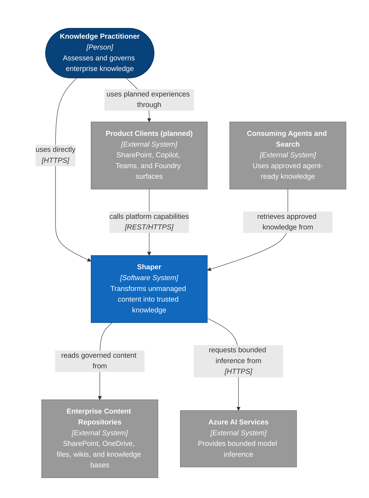
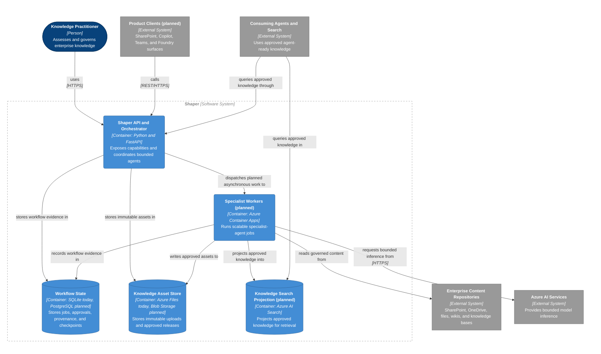
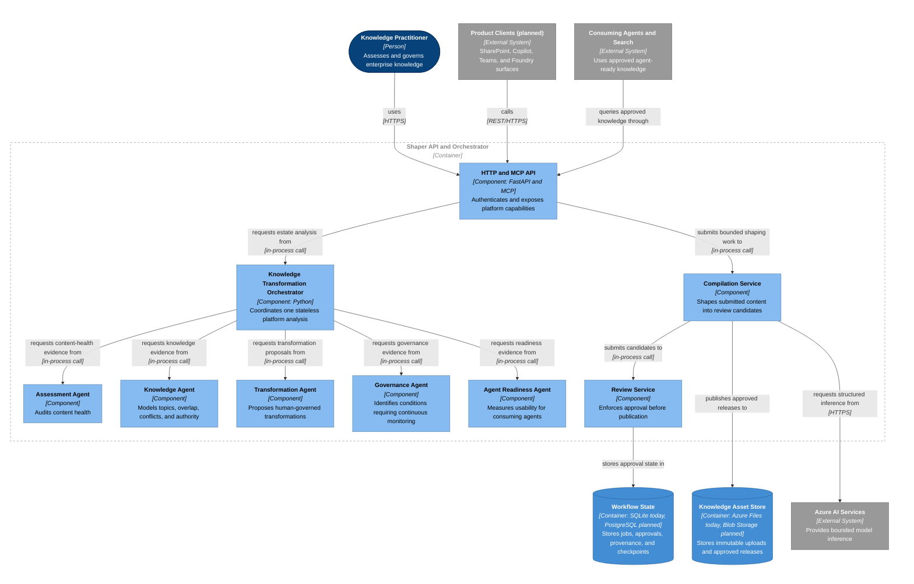

## Architectural position

Shaper is not an agent. It is an Azure-native Knowledge Transformation Platform
that coordinates bounded specialist agents while retaining deterministic control
of identity, authorization, evidence lineage, workflow, approval, and publication.

An agent is a capability role inside the platform. A role can use deterministic
analysis, model-assisted reasoning, or both. Calling a component an agent does
not grant it authority to modify source content or bypass human review.

The diagrams describe the planned platform architecture. Labels identify planned
elements that are not part of the current deployment. The current MVP runs the
API, orchestrator, specialist analysis roles, transformation kernel, and review
boundary in one Azure Container Apps container.

## System Context

## Containers

## Shaper API and Orchestrator Components

## Agent responsibility boundaries

| Specialist role       | Owns                                                            | Does not own                                      |
|-----------------------|-----------------------------------------------------------------|---------------------------------------------------|
| Assessment Agent      | Content health, metadata, staleness, ownership, readability     | Topic authority or source mutation                |
| Knowledge Agent       | Topics, entities, relationships, overlap, conflicts, authority  | Approval or publication                           |
| Transformation Agent  | Canonicalization, FAQ, summary, metadata, and procedure proposals | Autonomous overwrite or publication             |
| Governance Agent      | Duplicate, contradiction, ownership, freshness, authority health | Current recurring scheduling in the MVP          |
| Agent Readiness Agent | Retrieval, clarity, FAQ, chunking, consistency, prioritized work | Accuracy or model-confidence claims               |

The Knowledge Agent is the central knowledge-understanding role. It turns
document-level evidence into topic and relationship evidence that informs
recommendations, transformation proposals, readiness, and later governance
checks. The deterministic orchestrator owns the sequence and shared assessment
identity, so no specialist can silently redefine the evidence boundary.

## Current implementation boundary

The authenticated `POST /v1/platform/analyses` endpoint performs one synchronous,
stateless analysis. It creates one immutable estate assessment and coordinates
all five specialist roles over that evidence. Every result references the same
assessment identity.

The Transformation Agent output is proposal-only and reports that estate-wide
execution is unavailable. The separate compilation service can shape one
submitted upload, but it still requires independent validation and human approval
before publication.

Continuous governance currently means identifying monitorable conditions.
Recurring scans, managed schedules, durable source checkpoints, and distributed
workers remain planned capabilities.

## Product surface order

1. Azure-native platform
2. REST API
3. Copilot Agent
4. SharePoint integration
5. Teams integration
6. Foundry integration

SharePoint remains an important source, dashboard, review, and delivery surface.
It does not define the Shaper system boundary.

## Sources and notation

C4 concepts are based on the [C4 Model](https://c4model.com/) by Simon Brown,
licensed under [CC BY 4.0](https://creativecommons.org/licenses/by/4.0/).
Mermaid syntax follows the [Mermaid flowchart documentation](https://mermaid.js.org/syntax/flowchart.html),
licensed under the [MIT License](https://github.com/mermaid-js/mermaid/blob/develop/LICENSE).
