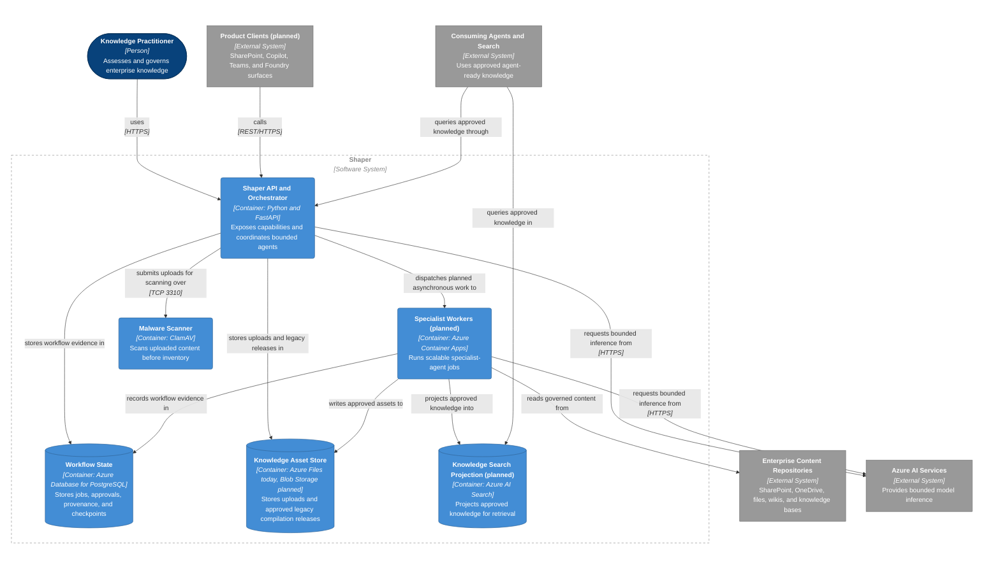
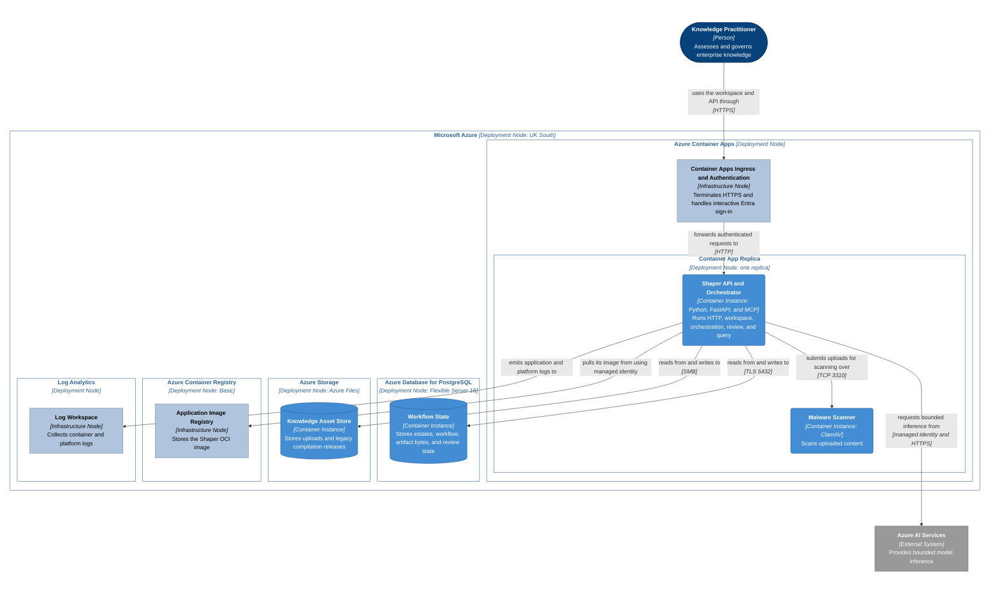
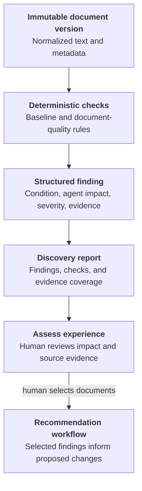
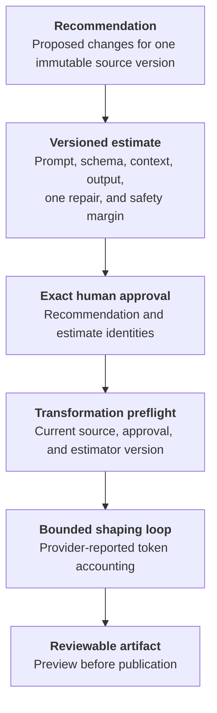

## Architectural position

Shaper is not an agent. It is an Azure-native Knowledge Transformation Platform
that coordinates bounded specialist agents while retaining deterministic control
of identity, authorization, evidence lineage, workflow, approval, and publication.

An agent is a capability role inside the platform. A role can use deterministic
analysis, model-assisted reasoning, or both. Calling a component an agent does
not grant it authority to modify source content or bypass human review.

The system context, container, and component diagrams describe the planned
platform architecture. Labels identify planned elements that are not part of the
current deployment. The current MVP runs the API, orchestrator, specialist
analysis roles, transformation kernel, and review boundary in one application
container. A ClamAV sidecar runs beside it in the same Azure Container Apps
replica.

## Diagram notation

```mermaid
---
config:
  flowchart:
    subGraphTitleMargin:
      bottom: 30
---
flowchart LR
    person_legend(["`**Name**
*[Person]*
Description`"])
    sys_legend["`**Name**
*[Software System]*
Description`"]
    ctr_legend("`**Name**
*[Container]*
Description`")
    cmp_legend["`**Name**
*[Component]*
Description`"]
    ext_legend["`**Name**
*[External System]*
Description`"]
    ext_legend_store[("`**Name**
*[External Data Store]*
Description`")]
    infra_legend["`**Name**
*[Infrastructure Node]*
Description`"]

    subgraph deploy_legend["`**Parent Name** *[Deployment Node]*`"]
        subgraph deploy_nested_legend["`**Nested Name**
*[Deployment Node]*`"]
            ctr_legend_i("`**Name**
*[Container Instance]*
Description`")
        end
    end

    subgraph bnd_legend["`**Name**
*[Software System]*`"]
        ctr_legend_store[("`**Name**
*[Internal Data Store]*
Description`")]
    end

    %% Layout only: chains the entries into a single row
    person_legend ~~~ sys_legend
    sys_legend ~~~ ctr_legend
    ctr_legend ~~~ cmp_legend
    cmp_legend ~~~ ext_legend
    ext_legend ~~~ ext_legend_store
    ext_legend_store ~~~ infra_legend
    infra_legend ~~~ deploy_legend
    deploy_legend ~~~ bnd_legend

    classDef person fill:#08427b,stroke:#052e56,color:#ffffff
    classDef system fill:#1168bd,stroke:#0b4884,color:#ffffff
    classDef container fill:#438dd5,stroke:#2e6295,color:#ffffff
    classDef component fill:#85bbf0,stroke:#5d82a8,color:#000000
    classDef external fill:#999999,stroke:#6b6b6b,color:#ffffff
    classDef infrastructure fill:#b0c4de,stroke:#7b899b,color:#000000

    class person_legend person
    class sys_legend system
    class ctr_legend,ctr_legend_i,ctr_legend_store container
    class cmp_legend component
    class ext_legend,ext_legend_store external
    class infra_legend infrastructure

    style deploy_legend fill:none,stroke:#2e6295,color:#2e6295
    style deploy_nested_legend fill:none,stroke:#2e6295,color:#2e6295
    style bnd_legend fill:none,stroke:#888888,stroke-dasharray:5 5,color:#888888
```

## System Context

## Containers

## Current Azure development deployment

The deployed development topology is intentionally smaller than the planned
container architecture. One Container App replica contains the application and
malware-scanning containers. Container Apps authentication handles interactive
Microsoft Entra sign-in, while the application validates bearer tokens for the
MCP endpoint.

PostgreSQL is authoritative for Knowledge Estate records and for generated
Knowledge Estate artifact bytes. The Azure Files mount supplies
`SHAPER_UPLOAD_ROOT` and `SHAPER_RELEASE_ROOT` through the container image, so
uploads and the separate legacy compilation release format survive revision
changes. A process-local SQLite database retains only legacy compilation
checkpoints and candidates and is not authoritative across revisions.

## Shaper API and Orchestrator Components

```mermaid
---
config:
  flowchart:
    subGraphTitleMargin:
      bottom: 30
---
flowchart TB
    subgraph layout_top[" "]
        person_knowledge_practitioner(["`**Knowledge Practitioner**
*[Person]*
Assesses and governs enterprise knowledge`"])
        ext_product_clients["`**Product Clients (planned)**
*[External System]*
SharePoint, Copilot, Teams, and Foundry surfaces`"]
        ext_consuming_agents["`**Consuming Agents and Search**
*[External System]*
Uses approved agent-ready knowledge`"]
    end

    subgraph layout_center[" "]
        subgraph ctr_shaper_api_orchestrator["`**Shaper API and Orchestrator**
*[Container]*`"]
            cmp_http_mcp_api["`**HTTP and MCP API**
*[Component: FastAPI and MCP]*
Authenticates and exposes platform capabilities`"]
            cmp_knowledge_transformation_orchestrator["`**Knowledge Transformation Orchestrator**
*[Component: Python]*
Coordinates one stateless platform analysis`"]
            cmp_assessment_agent["`**Assessment Agent**
*[Component]*
Audits content health`"]
            cmp_knowledge_agent["`**Knowledge Agent**
*[Component]*
Models topics, overlap, conflicts, and authority`"]
            cmp_transformation_agent["`**Transformation Agent**
*[Component]*
Proposes human-governed transformations`"]
            cmp_governance_agent["`**Governance Agent**
*[Component]*
Identifies conditions requiring continuous monitoring`"]
            cmp_agent_readiness_agent["`**Agent Readiness Agent**
*[Component]*
Explains evidence-backed risks to consuming-agent behavior`"]
            cmp_compilation_service["`**Compilation Service**
*[Component]*
Shapes submitted content into review candidates`"]
            cmp_estate_recommendation_service["`**Estate Recommendation Service**
*[Component]*
Creates proposals with versioned token estimates`"]
            cmp_estate_transformation_service["`**Estate Transformation Service**
*[Component]*
Executes exactly approved document proposals`"]
            cmp_review_service["`**Review Service**
*[Component]*
Enforces approval before publication`"]
        end
    end

    subgraph layout_bottom[" "]
        ctr_workflow_state[("`**Workflow State**
*[Container: Azure Database for PostgreSQL]*
Stores jobs, approvals, provenance, and checkpoints`")]
        ctr_knowledge_asset_store[("`**Knowledge Asset Store**
*[Container: Azure Files today, Blob Storage planned]*
Stores uploads and approved legacy compilation releases`")]
        ctr_malware_scanner("`**Malware Scanner**
*[Container: ClamAV]*
Scans uploaded content before inventory`")
        ext_azure_ai_services["`**Azure AI Services**
*[External System]*
Provides bounded model inference`"]
    end

    person_knowledge_practitioner --->|"`uses
*[HTTPS]*`"| cmp_http_mcp_api
    ext_product_clients --->|"`calls
*[REST/HTTPS]*`"| cmp_http_mcp_api
    ext_consuming_agents --->|"`queries approved knowledge through`"| cmp_http_mcp_api
    cmp_http_mcp_api -->|"`requests estate analysis from
*[in-process call]*`"| cmp_knowledge_transformation_orchestrator
    cmp_knowledge_transformation_orchestrator -->|"`requests content-health evidence from
*[in-process call]*`"| cmp_assessment_agent
    cmp_knowledge_transformation_orchestrator -->|"`requests knowledge evidence from
*[in-process call]*`"| cmp_knowledge_agent
    cmp_knowledge_transformation_orchestrator -->|"`requests transformation proposals from
*[in-process call]*`"| cmp_transformation_agent
    cmp_knowledge_transformation_orchestrator -->|"`requests governance evidence from
*[in-process call]*`"| cmp_governance_agent
    cmp_knowledge_transformation_orchestrator -->|"`requests readiness evidence from
*[in-process call]*`"| cmp_agent_readiness_agent
    cmp_http_mcp_api -->|"`submits bounded shaping work to
*[in-process call]*`"| cmp_compilation_service
    cmp_http_mcp_api -->|"`requests transformation proposals from
*[in-process call]*`"| cmp_estate_recommendation_service
    cmp_http_mcp_api -->|"`submits exactly approved proposals to
*[in-process call]*`"| cmp_estate_transformation_service
    cmp_http_mcp_api -->|"`submits uploads for scanning over
*[TCP 3310]*`"| ctr_malware_scanner
    cmp_compilation_service -->|"`requests structured inference from
*[HTTPS]*`"| ext_azure_ai_services
    cmp_compilation_service -->|"`submits candidates to
*[in-process call]*`"| cmp_review_service
    cmp_estate_transformation_service -->|"`requests structured inference from
*[HTTPS]*`"| ext_azure_ai_services
    cmp_estate_transformation_service -->|"`submits generated artifacts to
*[in-process call]*`"| cmp_review_service
    cmp_estate_transformation_service -->|"`stores artifact state and bytes in`"| ctr_workflow_state
    cmp_review_service -->|"`stores approval state in`"| ctr_workflow_state
    cmp_compilation_service -->|"`publishes approved releases to`"| ctr_knowledge_asset_store

    classDef person fill:#08427b,stroke:#052e56,color:#ffffff
    classDef component fill:#85bbf0,stroke:#5d82a8,color:#000000
    classDef container fill:#438dd5,stroke:#2e6295,color:#ffffff
    classDef external fill:#999999,stroke:#6b6b6b,color:#ffffff

    class person_knowledge_practitioner person
    class cmp_http_mcp_api,cmp_knowledge_transformation_orchestrator,cmp_assessment_agent,cmp_knowledge_agent,cmp_transformation_agent,cmp_governance_agent,cmp_agent_readiness_agent,cmp_compilation_service,cmp_estate_recommendation_service,cmp_estate_transformation_service,cmp_review_service component
    class ctr_workflow_state,ctr_knowledge_asset_store,ctr_malware_scanner container
    class ext_product_clients,ext_consuming_agents,ext_azure_ai_services external

    style layout_top fill:none,stroke:none
    style layout_center fill:none,stroke:none
    style layout_bottom fill:none,stroke:none
    style ctr_shaper_api_orchestrator fill:none,stroke:#888888,stroke-dasharray:5 5,color:#888888
```

## Agent responsibility boundaries

| Specialist role       | Owns                                                            | Does not own                                      |
|-----------------------|-----------------------------------------------------------------|---------------------------------------------------|
| Assessment Agent      | Content health, metadata, staleness, ownership, readability     | Topic authority or source mutation                |
| Knowledge Agent       | Topics, entities, relationships, overlap, conflicts, authority  | Approval or publication                           |
| Transformation Agent  | Canonicalization, FAQ, summary, metadata, and procedure proposals | Autonomous overwrite or publication             |
| Governance Agent      | Duplicate, contradiction, ownership, freshness, authority health | Current recurring scheduling in the MVP          |
| Agent Readiness Agent | Retrieval, clarity, FAQ, chunking, consistency, prioritized work | Accuracy or model-confidence claims               |

The Knowledge Agent is the central knowledge-understanding role. It turns
document-level evidence into topic and relationship evidence that informs
recommendations, transformation proposals, readiness, and later governance
checks. The deterministic orchestrator owns the sequence and shared assessment
identity, so no specialist can silently redefine the evidence boundary.

## Assessment evidence architecture

Shaper has three related evaluation contracts with different audiences:

| Contract | Scope | Primary output | Consumer |
|---|---|---|---|
| Estate assessment | A supplied set of normalized profiles | Dimensions, evidence coverage, findings, topics, and interventions | Platform API and specialist-agent orchestration |
| Document discovery report | One immutable document version, assessed with its estate peers | Findings, agent impact, evidence, and completed checks | Knowledge Estate Assess experience and recommendation workflow |
| Transformation evaluation | One generated artifact compared with its approved source | Deterministic validation checks and artifact-quality measures | Output review and publication workflow |

The Knowledge Estate user experience is findings-led. It does not present the
per-document heuristic as a readiness score or rank documents by a number.
Internal deterministic metrics remain part of the document report for
compatibility, report identity, evidence coverage, and effort estimation. They
are implementation evidence, not a user-facing accuracy or confidence claim.

The estate-list API derives assessment coverage from current, non-deleted
document versions and completed or partial discovery reports. A report counts
only when its `source_version` matches the document's current version, preventing
historical evidence from making changed content appear assessed. The
authenticated `GET /v1/assessment-checks` endpoint exposes the same 29-code
catalogue used by the workspace to explain each check and its likely agent
impact.

Each `DocumentFinding` separates four concerns:

* `explanation` states the source condition that the check detected
* `agent_impact` states how that condition can affect retrieval or an agent answer
* `evidence` provides bounded source quotes and normalized locations
* `severity` and `review_required` support prioritization and human governance

`agent_impact` is optional at the storage boundary so reports written before the
field existed remain readable. New reports populate it for every supported
finding. The browser uses a code-keyed fallback for older reports and a generic
impact statement for an unknown future finding type.

This separation matters because one numeric score hides materially different
failure modes. A missing appendix, conflicting threshold, inaccessible image,
and oversized paragraph can all lower content suitability for different reasons
and require different remediation. Findings preserve that causal information so
the reviewer can see what could fail, why agent behavior could degrade, and
which source evidence supports the conclusion.

Transformation evaluation remains separate from source assessment. Its
artifact-quality measures describe deterministic checks applied after shaping.
They do not reinstate a subjective readiness score in the Assess experience.

## Governed transformation and token budget

A transformation can run only when its decision exactly matches the source
version, recommendation version, estimate identity, estimator version, and model
deployment. The approved estimate therefore forms part of the authorization
boundary rather than serving as advisory UI text.

The estimator derives fixed request overhead from the active shaping prompt and
structured-response schema. It adds the source, request-envelope, and expected
output ranges, then reserves the initial response, one bounded repair, and a
safety margin. The shaping loop accounts for provider-reported input and output
tokens after every response and stops when the approved maximum is exceeded.

An estimator-version change invalidates an earlier approval for execution.
The service rejects the stale estimate before calling the model and tells the
reviewer to request recommendations again and approve the revised maximum. It
does not silently enlarge a previously approved budget.

## Current implementation boundary

The authenticated `POST /v1/platform/analyses` endpoint performs one synchronous,
stateless analysis. It creates one immutable estate assessment and coordinates
all five specialist roles over that evidence. Every result references the same
assessment identity.

The authenticated Knowledge Estate discovery endpoints create durable
per-document reports. Those reports are persisted as complete JSON records in
the configured estate store. The Assess experience renders their structured
findings and agent-impact explanations, while recommendations remain a separate,
selection-scoped workflow.

The platform-analysis Transformation Agent is proposal-only and reports that
estate-wide execution is unavailable. The Knowledge Estate workflow can execute
an individually approved proposal, persist a generated artifact and its
evaluation, expose a reviewer-only preview, and publish only after a separate
review approval. The legacy compilation workflow can shape one submitted upload
into a versioned release and also requires independent validation and human
approval before publication.

Continuous governance currently means identifying monitorable conditions.
Recurring scans, managed schedules, durable source checkpoints, and distributed
workers remain planned capabilities.

## Product surface order

1. Azure-native platform
2. REST API
3. Copilot Agent
4. SharePoint integration
5. Teams integration
6. Foundry integration

SharePoint remains an important source, dashboard, review, and delivery surface.
It does not define the Shaper system boundary.

## Sources and notation

C4 concepts are based on the [C4 Model](https://c4model.com/) by Simon Brown,
licensed under [CC BY 4.0](https://creativecommons.org/licenses/by/4.0/).
Mermaid syntax follows the [Mermaid flowchart documentation](https://mermaid.js.org/syntax/flowchart.html),
licensed under the [MIT License](https://github.com/mermaid-js/mermaid/blob/develop/LICENSE).
