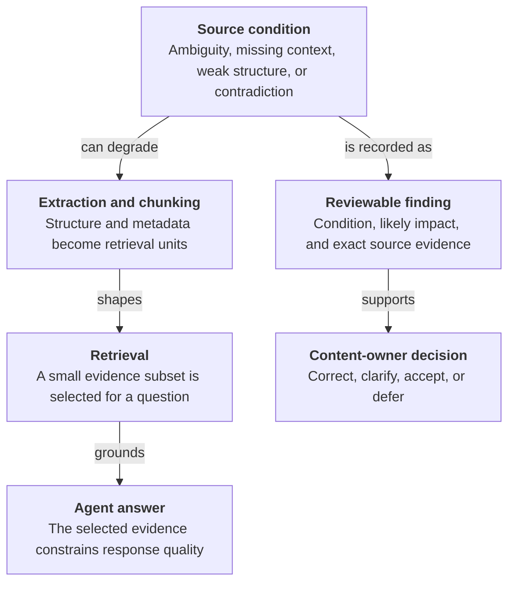

## Purpose

Use this checklist before ingesting a document into a retrieval-augmented
generation pipeline, support bot, or internal assistant. The checks identify
properties that can cause an agent to retrieve the wrong information, surface
contradictory guidance, or generate an unsupported answer because the source is
ambiguous, incomplete, or difficult to parse.

Each check explains what to inspect, why the condition affects an agent, and how
to resolve or flag it.

## Why document readiness matters

An agent does not read a document in the same way a person does. An ingestion
pipeline extracts text, divides it into chunks, enriches those chunks with
metadata, and retrieves a small subset for each question. Every stage can amplify
a source defect:

* Weak structure creates poor chunk boundaries
* Missing metadata weakens filtering and ranking
* Unresolved references remove context from the retrieved passage
* Contradictions let retrieval surface incompatible answers
* Ambiguous rules encourage unsupported specificity
* Missing provenance makes current and obsolete guidance look equally valid
* Content trapped in images or objects can disappear during extraction

These are not cosmetic writing issues. They affect whether the agent receives
the right evidence and whether that evidence supports a complete, consistent
answer. A single readiness score cannot explain which failure mode is present or
what must change. Reviewable findings are more useful because each one connects
the detected condition to its likely agent impact and the exact source evidence.

Shaper uses this model in the Knowledge Estate Assess experience. Deterministic
checks create structured findings; the interface shows what was detected, why it
can affect agent performance, and where it appears in the source. A content owner
then decides whether and how to change the document. The assessment does not
prove semantic, legal, or policy correctness, and it does not authorize an
automatic rewrite.

See the [assessment evidence architecture](architecture.md#assessment-evidence-architecture)
for the data flow and the [feature guide](features.md#content-focused-findings)
for the implemented review experience.

## 1. Check file format suitability

Confirm that the source format preserves structure before reviewing its content.
Format affects how reliably a parser can reconstruct headings, lists, tables,
and links. That reconstruction directly affects chunk quality and retrieval
accuracy.

| Format | Suitability | Why |
|---|---|---|
| Markdown (`.md`) | Best | Structure is explicit in plain text, so headings, lists, tables, and links require no layout inference. |
| HTML (`.html`) | Very good when semantic | Heading, list, table, and link elements expose structure directly. Styling-only markup without semantic elements degrades extraction quality. |
| Word (`.docx`) | Good when disciplined | Native heading styles, numbered lists, and tables preserve structure. Manual visual formatting, tracked changes, comments, text boxes, headers, and footers can pollute or disappear during extraction. |
| PDF (`.pdf`) | Weakest | PDF represents visual layout rather than semantic structure. Columns, headers, footers, tables, and scans often require unreliable extraction or OCR. |
| Plain text (`.txt`) | Poor | The format has no explicit headings, tables, or links and is suitable only for short, flat content. |
| Slides or spreadsheets used as prose | Poor to fair | Content is fragmented across slides or cells, and visual relationships often disappear during extraction. |

Prefer Markdown or semantic HTML as the canonical ingestion format. For Word
sources, require real heading styles, lists, and tables before conversion.
Convert and clean PDFs before ingestion, then manually verify the extracted
structure.

## 2. Check structural integrity

Inspect the document for:

* A consistent heading hierarchy with no skipped levels or headings used only
  for visual emphasis
* Native numbered and bulleted lists rather than list-like text inside paragraphs
* Real tables with header rows rather than text arranged to look like a table
* Sections that each cover one coherent topic instead of large,
  undifferentiated blocks

### Agent impact

Retrieval pipelines commonly split documents at heading or section boundaries.
Weak structure creates arbitrary chunks that can divide one rule or combine
unrelated topics. The agent can then retrieve incomplete or irrelevant context.

### Recommended action

Normalize heading levels, convert visual lists and tables into semantic
structures, and split long sections into focused subsections before ingestion.

## 3. Check cross-references and dependencies

Inspect the document for:

* Internal references whose target section is missing or does not contain the
  expected information
* External documents, appendices, forms, or systems that are not available in
  the same knowledge base
* Circular references in which two sections point to each other without defining
  the rule
* References to missing or retired attachments

### Agent impact

An agent cannot follow a reference to material that its knowledge base does not
contain. An unresolved reference becomes either a dead end or an invitation to
fill the gap with plausible but unsupported content.

### Recommended action

Resolve every cross-reference before ingestion. Inline the required content or
include the referenced source under a stable identifier. Treat missing external
content and circular references as blocking findings.

## 4. Check ambiguity and vagueness

Inspect the document for:

* Vague quantifiers such as "approximately," "typically," "generally," or
  "roughly"
* Decisions left to unspecified discretion or a case-by-case process
* Undefined terms that the document treats as established
* Different terms that may refer to the same concept
* Conditions that never resolve to a concrete rule

### Agent impact

Agents are expected to provide concrete, actionable answers. Vague source
language forces the agent either to repeat the ambiguity or invent unsupported
specifics.

### Recommended action

Replace vague quantifiers with concrete values or explicit ranges. Define terms
that recur, select one term for each concept, and state decision criteria for
discretionary cases.

## 5. Check consistency and contradictions

Inspect the document for:

* Different numbers, dates, durations, or thresholds for the same rule
* Conflicting precedence or authority statements
* Current and superseded sections presented together without status markers
* Terminology that drifts between sections or authors

### Agent impact

When retrieval surfaces conflicting chunks, the agent has no reliable basis for
choosing the governing rule. It may return either answer confidently depending
on which chunk ranks higher for a particular query.

### Recommended action

Compare every numeric value, date, and named threshold with similar statements.
Remove or clearly mark superseded content. State a clear precedence rule wherever
multiple sources can apply.

## 6. Check completeness

Inspect the document for:

* Empty or missing appendices, tables, and definitions
* Placeholders such as `TBD`, "not included," or "to be completed"
* Rules that vary by jurisdiction or team without the required breakdown
* Programs or pilots with no current status, start date, or end date

### Agent impact

Incomplete content causes the agent either to return no useful answer or to
infer details that the source does not support.

### Recommended action

Resolve placeholders and missing referenced material before publication. Include
the required breakdown when information varies, or state the document's scope
and exclusions explicitly.

## 7. Check provenance, authority, and versioning

Inspect the document for:

* A clear effective date and version
* One identifiable source of truth for each topic
* Duplicate facts spread across a handbook, wiki, slide deck, email, or other
  sources that can drift independently
* References to an unspecified latest communication or verbal clarification
* Superseded content mixed with the current version

### Agent impact

An agent cannot independently determine authority or recency. Unless the source
states precedence, it can treat outdated and current content as equally valid.

### Recommended action

Record an effective date and version in metadata or the document header. Maintain
one canonical source per topic. When multiple documents legitimately cover the
same topic, state which source governs in a conflict.

## 8. Check retrieval and chunking readiness

Inspect the document for:

* Sections that depend heavily on earlier context
* Generic headings that provide weak retrieval signals
* Critical information duplicated with subtle variations
* Tables and lists that lose meaning when retrieved without the preceding
  paragraph

### Agent impact

Knowledge systems retrieve sections or paragraphs rather than whole documents.
A context-dependent chunk can be retrieved alone and interpreted incorrectly.

### Recommended action

Make sections self-contained where practical. Use specific headings, add titles
or captions to tables and lists, and consolidate repeated facts into one
canonical location.

## 9. Check formatting and parsing hygiene

Inspect the document for:

* Images that contain text without equivalent text or a transcription
* Content trapped in text boxes, SmartArt, embedded objects, form fields, or
  annotations
* Broken characters or inconsistent numbering caused by copy and paste
* Unrelated topics under one heading or one topic split across disconnected
  headings

### Agent impact

Content that cannot be extracted as text is invisible to most ingestion
pipelines. The agent may answer as if that information does not exist.

### Recommended action

Transcribe information stored in images and non-text objects. Run the source
through the intended parser before ingestion. Compare the extracted text with the
rendered document and fix missing, reordered, or garbled content.

## Summary checklist

| # | Check category | Pass criteria |
|---:|---|---|
| 1 | File format | Markdown or semantic HTML is preferred; Word uses native styles; converted PDF structure is verified. |
| 2 | Structural integrity | Headings are consistent, lists and tables are semantic, and sections cover one topic. |
| 3 | Cross-references | Every dependency resolves to available content and no circular reference remains. |
| 4 | Ambiguity | Key terms and conditions are concrete, defined, and consistent. |
| 5 | Consistency | Numbers, dates, terminology, and precedence rules do not conflict. |
| 6 | Completeness | No placeholder, missing appendix, or unresolved enumeration remains. |
| 7 | Provenance and versioning | Effective date, version, authority, and source of truth are explicit. |
| 8 | Retrieval readiness | Sections are self-contained, headings are descriptive, and duplication is controlled. |
| 9 | Formatting hygiene | Required content is extractable as text and parser output matches the source. |

## Recommended workflow

1. Convert the source to Markdown or clean semantic HTML when needed.
2. Verify that headings, lists, and tables parse correctly.
3. Resolve every internal and external reference.
4. Review ambiguity and contradictions with a domain expert who can supply
   concrete rules.
5. Confirm completeness, authority, effective date, and version.
6. Run the intended ingestion pipeline and inspect the resulting chunks.
7. Repeat the checks after edits that can affect related sections.

Treat readiness as an ongoing control rather than a one-time gate. Reassess
documents after policy or source changes because content can drift after an
initial review.
