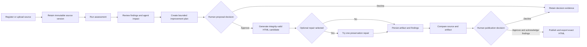

## Executive Summary

Enterprise knowledge is usually authored for human readers, not for extraction,
chunking, retrieval, grounding, and agent-generated answers. Weak structure,
missing context, ambiguous language, contradictions, unsupported claims, and
buried qualifiers can therefore cause an agent to retrieve the wrong passage or
produce an incomplete answer.

Shaper addresses this problem as an Azure-native Knowledge Transformation
Platform. It organizes content into governed Knowledge Estates, assesses each
document through evidence-backed findings, explains the likely impact on agent
performance, and proposes bounded improvements. Approved source content can be
reshaped into semantic HTML without modifying the immutable original.

Human authority remains explicit throughout the workflow. Recommendation
approval is exact and version-pinned. Generation-integrity controls cannot be
bypassed. Representation-sensitive preservation findings remain visible for
review instead of automatically destroying a usable artifact. Publication is a
separate decision that requires acknowledgment of the current findings.

The primary business success measure is the percentage of pilot artifacts that
complete the governed path from source assessment through human publication
approval while retaining complete evidence lineage. This draft defines the
business requirements for that outcome without claiming unmeasured accuracy,
return on investment, or agent-performance uplift.

## Business Context

Organizations increasingly use retrieval-augmented agents and enterprise search
over content originally created for policies, intranets, wikis, and human
reference. Content-management platforms govern storage and access, while
retrieval platforms find passages. Neither function, by itself, establishes
whether the source is sufficiently clear, current, structured, and authoritative
for an agent to use reliably.

Shaper fills the business gap between content governance and retrieval. It does
not replace a content repository, enterprise search service, or RAG pipeline.
It gives knowledge owners a governed process for identifying source-quality
risks and preparing approved derivatives for downstream use.

The current implemented product is an authenticated Azure deployment with a
browser workspace, REST interface, and MCP interface. It supports file and
bounded ZIP upload, URL and SharePoint registration, 31 deterministic assessment
checks, findings-led review, approved-only transformation, up to 20 grounded
evaluation questions, artifact comparison, approval, and HTML export.

## Stakeholders

| Stakeholder | Power | Interest | Accountability | Engagement strategy |
|---|---|---|---|---|
| Business sponsor | High | High | Owns investment and business outcome | Manage closely; approve BRD and pilot success measures |
| Shaper product owner | High | High | Owns scope and product decisions | Manage closely; maintain requirements and priorities |
| Knowledge governance lead | High | High | Owns knowledge policy and publication authority | Manage closely; approve governance rules and exceptions |
| Content owner or reviewer | Medium | High | Reviews findings, proposals, and artifacts | Involve in workflow testing and acceptance |
| Agent or search product owner | Medium | High | Consumes approved knowledge assets | Consult on evaluation questions and downstream usability |
| Security and identity lead | High | Medium | Owns identity, authorization, and secrets posture | Keep satisfied; review access and deployment controls |
| Platform operations | Medium | High | Operates Azure services and incident response | Involve in deployment, monitoring, and recovery design |
| Legal or compliance reviewer | High | Variable | Reviews regulated content use when applicable | Engage according to estate content and organizational policy |
| Application user | Low | High | Performs day-to-day assessment and review | Observe, test, train, and collect usability feedback |

## Design Decisions

| ID | Decision | Rationale | Status |
|---|---|---|---|
| DD-001 | Findings shall replace user-facing readiness scores | Specific evidence and agent impact support action better than an opaque score | Accepted |
| DD-002 | Source documents shall remain immutable | Preserves provenance, auditability, and recovery | Accepted |
| DD-003 | Findings shall not grant transformation authority | Separates diagnosis from the human-approved change boundary | Accepted |
| DD-004 | Preservation diagnostics shall be advisory during artifact generation | Representation-sensitive checks can produce false positives | Accepted |
| DD-005 | Evidence integrity and exclusion authority shall remain non-bypassable | Prevents ungrounded or unauthorized output from becoming reviewable content | Accepted |
| DD-006 | Publication approval shall be separate from proposal approval | Reviewers must inspect the actual generated artifact | Accepted |
| DD-007 | Approved artifacts shall be exportable as exact stored HTML bytes | Prevents the exported asset from differing from the reviewed asset | Accepted |

## Business Goals

### BG-001: Make source-quality risks actionable

* Priority: MUST.
* KPI: Percentage of current-version findings that contain a plain-language
  description, agent-impact explanation, and bounded source evidence.
* Baseline: To be established during the first governed pilot.
* Target: 100 percent.
* Timeframe: Throughout the pilot and at production acceptance.
* Measurement source: Persisted discovery reports and contract tests.
* Owner: Shaper Product Owner.

### BG-002: Preserve human control and source integrity

* Priority: MUST.
* KPI: Percentage of published artifacts with immutable source lineage, exact
  proposal approval, artifact review, and publication approval.
* Baseline: To be established during the first governed pilot.
* Target: 100 percent.
* Timeframe: Throughout the pilot and at production acceptance.
* Measurement source: Workflow, decision, review, and artifact records.
* Owner: Knowledge Governance Lead.

### BG-003: Produce usable agent-ready derivatives

* Priority: MUST.
* KPI: Percentage of integrity-valid pilot transformations that produce a
  reviewable semantic HTML artifact or an explicit actionable failure.
* Baseline: To be established during the first governed pilot.
* Target: At least 95 percent, excluding provider outages and invalid approvals.
* Timeframe: Measured over the final 30 days of the pilot.
* Measurement source: Transformation run and artifact records.
* Owner: Shaper Product Owner.

### BG-004: Support downstream evaluation

* Priority: SHOULD.
* KPI: Percentage of eligible pilot estates for which reviewers can export a
  distinct, source-grounded evaluation set.
* Baseline: To be established during the first governed pilot.
* Target: 100 percent of eligible estates, with up to 20 questions per estate.
* Timeframe: By pilot completion.
* Measurement source: Evaluation-set export and source-linkage records.
* Owner: Agent Product Owner.

### SMART Evaluation

* [x] Specific: Each goal identifies an observable governed outcome.
* [x] Measurable: Each goal defines a KPI and target.
* [ ] Achievable: Formal assessment awaits pilot capacity and stakeholder review.
* [x] Relevant: Goals address reliable, governed agent knowledge.
* [x] Time-bound: Each goal has a pilot or acceptance horizon.

Status: Deferred until pilot owners approve baselines, capacity, and measurement
sources.

### Outcome Hypothesis Handoff Provenance

No formal outcome-hypothesis handoff was supplied. Business goals were derived
from the implemented product and repository documentation. No external outcome
claims were imported.

## Business Rules

| ID | Rule | Category | Enforceability | Enforcing requirements |
|---|---|---|---|---|
| BR-001 | Source content shall remain immutable after ingestion | Operational | Mandatory | FR-002, FR-008 |
| BR-002 | Findings shall provide evidence and likely agent impact without a user-facing score out of 100 | Product policy | Mandatory | FR-003 |
| BR-003 | Findings and model output shall not authorize content changes | Governance | Mandatory | FR-005, FR-006 |
| BR-004 | Only an exact, current, approved proposal may enter transformation | Governance | Mandatory | FR-006 |
| BR-005 | Source identity, cited evidence, candidate schema, exclusion authority, and retained excluded content shall remain non-bypassable integrity controls | Governance | Mandatory | FR-007 |
| BR-006 | Preservation findings may inform one bounded repair and shall remain visible for human review | Governance | Mandatory | FR-007, FR-008 |
| BR-007 | Publication shall require a separate human decision against the current artifact and finding set | Governance | Mandatory | FR-009 |
| BR-008 | Exported HTML shall match the exact approved stored bytes | Operational | Mandatory | FR-010 |
| BR-009 | Registered SharePoint and URL sources shall not imply synchronization before a connector has ingested content | Product policy | Mandatory | FR-001 |
| BR-010 | Historical evidence and decision records shall remain auditable according to the active retention policy | Governance | Mandatory | FR-011 |

## Functional Requirements

### FR-001: Manage Knowledge Estates and sources

The platform shall allow authorized users to create and manage Knowledge Estates,
register supported source locations, and upload supported files or bounded ZIP
packages so that knowledge scope is explicit and governable.

* Actor: Knowledge practitioner.
* Trigger: Estate creation or source-management action.
* Expected outcome: The estate and source inventory are persisted with current
  status and provenance.
* Acceptance criteria: AC-001.
* Business goals: BG-001, BG-002.

### FR-002: Retain immutable source versions

The platform shall retain each ingested document as an immutable, addressable
source version so that findings, proposals, and artifacts can be traced to the
exact reviewed input.

* Actor: Platform.
* Trigger: Successful ingestion.
* Expected outcome: A version identity and retrievable source representation are
  persisted without modifying earlier versions.
* Acceptance criteria: AC-002.
* Business goals: BG-002.

### FR-003: Assess documents through findings

The platform shall run the current assessment catalogue against selected document
versions and present each detected issue with clear language, likely agent impact,
review status, and source evidence so that reviewers can make informed decisions.

* Actor: Knowledge practitioner and platform.
* Trigger: Discovery run.
* Expected outcome: A findings-led report is available without a user-facing
  readiness score.
* Acceptance criteria: AC-003.
* Business goals: BG-001.

### FR-004: Review complete source content

The platform shall let an authorized reviewer inspect the complete extracted text
and retrieve the exact retained source file so that bounded finding evidence can
be interpreted in full context.

* Actor: Knowledge reviewer.
* Trigger: Source-review action.
* Expected outcome: The exact current version is displayed or downloaded.
* Acceptance criteria: AC-004.
* Business goals: BG-001, BG-002.

### FR-005: Create bounded improvement plans

The platform shall create version-pinned improvement proposals only for selected
documents and shall distinguish authorized changes from flag-only findings so
that recommendations cannot silently expand transformation authority.

* Actor: Knowledge practitioner and platform.
* Trigger: Improvement-plan request.
* Expected outcome: Each proposal records source, report, prompt, estimator,
  actions, token estimate, and expected artifact identity.
* Acceptance criteria: AC-005.
* Business goals: BG-001, BG-002.

### FR-006: Govern proposal decisions

The platform shall accept an append-only approve or decline decision only against
the exact current proposal and source version so that stale or modified proposals
cannot be transformed.

* Actor: Authorized approver.
* Trigger: Proposal decision.
* Expected outcome: The decision and rationale are persisted and enforced.
* Acceptance criteria: AC-006.
* Business goals: BG-002.

### FR-007: Generate integrity-valid semantic HTML

The platform shall transform approved source content into escaped semantic HTML
under bounded model and token budgets while enforcing non-bypassable evidence and
exclusion controls so that only grounded candidates become reviewable artifacts.

* Actor: Platform.
* Trigger: Transformation of approved proposals.
* Expected outcome: The run creates an integrity-valid candidate or reports an
  actionable integrity or provider failure.
* Acceptance criteria: AC-007, AC-008.
* Business goals: BG-002, BG-003.

### FR-008: Retain preservation findings for review

The platform shall preserve representation-sensitive validation findings with an
integrity-valid artifact and shall optionally use them for one bounded repair so
that false-positive diagnostics do not block all practical use.

* Actor: Knowledge reviewer and platform.
* Trigger: Run-level repair selection or completed candidate validation.
* Expected outcome: A reviewable artifact includes the current findings even
  when repair does not resolve them.
* Acceptance criteria: AC-009.
* Business goals: BG-001, BG-003.

### FR-009: Govern artifact publication

The platform shall require a separate authorized publication decision against the
current artifact revision, review revision, acknowledged finding identities, and
human-entered rationale so that publication is deliberate and auditable.

* Actor: Knowledge reviewer.
* Trigger: Artifact approval.
* Expected outcome: Only an exactly reviewed artifact becomes approved.
* Acceptance criteria: AC-010.
* Business goals: BG-002.

### FR-010: Export approved HTML

The platform shall allow authorized users to export the exact stored bytes of an
approved HTML artifact using its governed filename so that downstream content
matches the reviewed publication.

* Actor: Authorized user.
* Trigger: Export action.
* Expected outcome: The approved bytes are downloaded; unapproved artifacts are
  denied.
* Acceptance criteria: AC-011.
* Business goals: BG-002, BG-003.

### FR-011: Preserve workflow and decision evidence

The platform shall persist estate, source, report, proposal, decision, run,
usage, review, artifact, and publication evidence so that authorized operators
can audit and recover the governed workflow.

* Actor: Platform operator and reviewer.
* Trigger: Any governed workflow transition.
* Expected outcome: Append-only or versioned records remain queryable according
  to authorization and retention policy.
* Acceptance criteria: AC-012.
* Business goals: BG-002.

### FR-012: Produce grounded evaluation sets

The platform shall generate up to 20 distinct questions grounded in eligible
estate content and balance them across documents so that downstream agent teams
can test common knowledge questions without duplicate filler.

* Actor: Agent product owner or knowledge practitioner.
* Trigger: Evaluation-set generation or export.
* Expected outcome: The set contains distinct questions linked to source content,
  or fewer questions when the estate lacks sufficient material.
* Acceptance criteria: AC-013.
* Business goals: BG-004.

### FR-013: Govern estate lifecycle

The platform shall support archive and confirmed purge operations under
authorization controls so that inactive estates can be removed from active use
without accidental deletion.

* Actor: Authorized estate administrator.
* Trigger: Archive or purge request.
* Expected outcome: Archive precedes purge and destructive action requires
  explicit confirmation.
* Acceptance criteria: AC-014.
* Business goals: BG-002.

## Non-Functional Requirements

### Functional Suitability

* NFR-001: The platform shall reject stale source, proposal, review, or artifact
  revisions at every governed decision boundary. Verification: automated
  concurrency and authorization tests.
* NFR-002: The platform shall preserve exact source and approved artifact bytes.
  Verification: deterministic hash and byte-equality tests.

### Performance Efficiency

* NFR-003: Each model request shall use the approved provider-side output-token
  cap and a 90-second request timeout. Verification: gateway configuration and
  integration tests.
* NFR-004: One document transformation shall use at most one initial shaping
  request and one optional targeted-repair request. Verification: model-call
  telemetry and shaping-loop tests.

### Compatibility

* NFR-005: The platform shall expose authenticated HTTPS interfaces for the
  browser workspace, REST clients, and MCP clients. Verification: interface and
  deployment smoke tests.

### Usability

* NFR-006: The browser workflow shall remain operable at 320 CSS pixels and 200
  percent browser zoom without loss of core actions or horizontal page
  scrolling. Verification: responsive browser inspection.
* NFR-007: Interactive controls, dialogs, tabs, progress, findings, and
  comparisons shall expose keyboard operation, visible focus, and accessible
  names. Verification: automated and manual accessibility review.

### Reliability

* NFR-008: Production readiness shall report state store, estate store, malware
  scanner, and compile-worker dependency status separately. Verification:
  readiness endpoint and deployment smoke test.
* NFR-009: A failed transformation shall not publish a partial artifact.
  Reviewable preservation findings are not transformation failures.
  Verification: workflow-state and artifact-persistence tests.

### Security

* NFR-010: Interactive access shall use Microsoft Entra authentication, while
  persisted collection roles shall enforce application authorization.
  Verification: authorization matrix tests.
* NFR-011: Uploaded content shall pass bounded type, size, archive, and malware
  controls before inventory creation. Verification: upload-security tests.
* NFR-012: The application container shall run as a non-root identity and use
  managed identity for supported Azure service access. Verification: deployment
  configuration inspection.
* NFR-013: Logs shall not contain source document content, access tokens,
  credentials, or connection strings. Verification: log inspection and security
  review.

### Maintainability

* NFR-014: Domain and API contract changes shall pass formatting, lint, strict
  typing, automated tests, coverage threshold, and schema-drift checks before
  release. Verification: CI and release evidence.
* NFR-015: Assessment, shaping, validation, publication, and documentation rules
  shall use explicit versioned contracts where compatibility requires them.
  Verification: contract tests and documentation drift review.

### Portability

* NFR-016: The application shall support local development with Python 3.11 and
  SQLite and Azure deployment with PostgreSQL without changing the domain
  workflow. Verification: local and hosted test suites.

## Constraints

| ID | Constraint | Imposing source | Boundary and impact |
|---|---|---|---|
| CON-001 | Azure is the target hosted platform | Project architecture | Deployment uses Container Apps, PostgreSQL, Container Registry, Azure OpenAI, managed identity, and Log Analytics |
| CON-002 | Source content cannot be modified by assessment or transformation | Governance decision | The product creates governed derivatives and retains immutable originals |
| CON-003 | Model inference is bounded by configured Azure OpenAI deployments and quota | External platform | Capacity, timeout, token budget, and rate-limit behavior affect transformation |
| CON-004 | SharePoint and URL entries remain registrations until connector synchronization is configured | Current product scope | The UI and documentation cannot imply unsupported crawling |
| CON-005 | Publication requires human review | Governance decision | Automatic publication is out of scope |
| CON-006 | Quantified agent-accuracy uplift and commercial return are not established | Evidence boundary | Product claims must remain qualitative until measured |
| CON-007 | The current hosted topology uses one application replica and a ClamAV sidecar | Current deployment | Scale and availability claims cannot exceed the implemented topology |
| CON-008 | Regulated-content approval depends on the deploying organization | Organizational governance | Legal and compliance review is conditional and cannot be automated by Shaper |

## Process Models

## Acceptance Criteria

* AC-001: Given an authorized practitioner, when they create an estate and add a
  supported source, then the estate and source appear in the current inventory.
  Covers: FR-001. Status: Completed.
* AC-002: Given an ingested document, when a newer version is ingested, then both
  versions retain distinct immutable identities and earlier evidence remains
  addressable. Covers: FR-002. Status: Completed.
* AC-003: Given an assessed document, when the reviewer opens a finding, then the
  interface shows what was detected, likely agent impact, review status, and
  source evidence without a score out of 100. Covers: FR-003. Status: Completed.
* AC-004: Given an authorized reviewer and exact source version, when they open
  full-document review or download the source, then the platform returns that
  version and rejects a mismatched version. Covers: FR-004. Status: Completed.
* AC-005: Given selected assessed documents, when the user requests an
  improvement plan, then each proposal is pinned to its source version,
  assessment evidence, approved actions, estimate, and expected artifact.
  Covers: FR-005. Status: Completed.
* AC-006: Given a current proposal, when an authorized reviewer approves or
  declines it, then the append-only decision applies only to that exact proposal
  and stale decisions cannot authorize transformation. Covers: FR-006. Status:
  Completed.
* AC-007: Given an approved proposal, when transformation runs, then model calls
  remain within approved timeout, token, and candidate budgets. Covers: FR-007.
  Status: Completed.
* AC-008: Given a candidate with invalid source identity, unavailable cited
  spans, invalid schema, unauthorized exclusion, or retained excluded content,
  when validation runs, then no reviewable artifact is created. Covers: FR-007.
  Status: Completed.
* AC-009: Given an integrity-valid candidate with preservation findings, when
  transformation completes, then the platform retains a reviewable artifact and
  its findings; when repair is selected, it makes no more than one repair call.
  Covers: FR-008. Status: Completed.
* AC-010: Given an artifact with current findings, when publication approval
  omits, adds, or mismatches finding acknowledgments or revisions, then approval
  is rejected; when all values match, then the decision is persisted. Covers:
  FR-009. Status: Completed.
* AC-011: Given an approved artifact, when an authorized user exports it, then
  the response bytes and governed filename match the reviewed artifact; given an
  unapproved artifact, export is denied. Covers: FR-010. Status: Completed.
* AC-012: Given a completed workflow transition, when an authorized operator
  queries its records, then version, decision, usage, review, and artifact
  evidence remain available according to retention policy. Covers: FR-011.
  Status: Completed.
* AC-013: Given eligible content across one or more documents, when evaluation
  questions are generated, then the set contains no more than 20 distinct,
  source-grounded questions balanced across documents and does not add filler
  when fewer are available. Covers: FR-012. Status: Completed.
* AC-014: Given an active estate, when an authorized administrator requests
  purge without prior archive or confirmation, then deletion is rejected; when
  governance preconditions are satisfied, then purge completes. Covers: FR-013.
  Status: Completed.

## Traceability Matrix

### FR-to-AC Coverage

| Source ID | Source title | Target ID(s) | Coverage |
|---|---|---|---|
| FR-001 | Estates and sources | AC-001 | 1 |
| FR-002 | Immutable versions | AC-002 | 1 |
| FR-003 | Findings-led assessment | AC-003 | 1 |
| FR-004 | Complete source review | AC-004 | 1 |
| FR-005 | Improvement plans | AC-005 | 1 |
| FR-006 | Proposal decisions | AC-006 | 1 |
| FR-007 | Integrity-valid HTML | AC-007, AC-008 | 2 |
| FR-008 | Preservation review | AC-009 | 1 |
| FR-009 | Publication governance | AC-010 | 1 |
| FR-010 | Approved export | AC-011 | 1 |
| FR-011 | Workflow evidence | AC-012 | 1 |
| FR-012 | Evaluation sets | AC-013 | 1 |
| FR-013 | Estate lifecycle | AC-014 | 1 |

Coverage: 100 percent. All 13 functional requirements link to one or more
acceptance criteria.

### FR-to-BG Alignment

| Source ID | Source title | Target ID(s) | Coverage |
|---|---|---|---|
| FR-001 | Estates and sources | BG-001, BG-002 | 2 |
| FR-002 | Immutable versions | BG-002 | 1 |
| FR-003 | Findings-led assessment | BG-001 | 1 |
| FR-004 | Complete source review | BG-001, BG-002 | 2 |
| FR-005 | Improvement plans | BG-001, BG-002 | 2 |
| FR-006 | Proposal decisions | BG-002 | 1 |
| FR-007 | Integrity-valid HTML | BG-002, BG-003 | 2 |
| FR-008 | Preservation review | BG-001, BG-003 | 2 |
| FR-009 | Publication governance | BG-002 | 1 |
| FR-010 | Approved export | BG-002, BG-003 | 2 |
| FR-011 | Workflow evidence | BG-002 | 1 |
| FR-012 | Evaluation sets | BG-004 | 1 |
| FR-013 | Estate lifecycle | BG-002 | 1 |

Coverage: 100 percent. All 13 functional requirements align to one or more
business goals.

### BR-to-FR Enforcement

| Source ID | Source title | Target ID(s) |
|---|---|---|
| BR-001 | Immutable sources | FR-002, FR-008 |
| BR-002 | Findings without scores | FR-003 |
| BR-003 | Diagnosis is not authority | FR-005, FR-006 |
| BR-004 | Exact approval | FR-006 |
| BR-005 | Integrity controls | FR-007 |
| BR-006 | Preservation review | FR-007, FR-008 |
| BR-007 | Separate publication | FR-009 |
| BR-008 | Exact export bytes | FR-010 |
| BR-009 | Registration is not synchronization | FR-001 |
| BR-010 | Auditable evidence | FR-011 |

## Risks and Assumptions

### Key Assumptions

| ID | Assumption | Evidence status | Impact if false | Mitigation | Source |
|---|---|---|---|---|---|
| ASM-001 | Knowledge owners can review findings and approve proposals | Partially supported | Workflow stalls without decision owners | Define estate ownership and escalation before onboarding | Current workflow |
| ASM-002 | Approved HTML is compatible with downstream ingestion | Untested outside prototype | Exported artifacts may require adaptation | Validate with each target agent platform during pilot | Product scope |
| ASM-003 | Azure OpenAI capacity supports bounded transformation demand | Partially supported | Runs may receive rate limits | Preflight quota and monitor HTTP 429 events | Deployment evidence |
| ASM-004 | The 31 checks identify useful review candidates across pilot content | Partially supported | Findings may be noisy or incomplete | Measure dispositions and calibrate rules without hiding evidence | Assessment design |
| ASM-005 | Pilot owners accept role-based approval and retention policy | Untested | Governance signoff may be delayed | Confirm RACI, retention, and exception authority before pilot | BRD discovery |

### Risk Register

| ID | Risk | Probability | Impact | Mitigation |
|---|---|---|---|---|
| RISK-001 | Deterministic preservation checks produce false positives | Medium | High | Keep representation-sensitive findings advisory and require human review |
| RISK-002 | Model output omits or changes substantive source content | Medium | High | Enforce evidence integrity, show before-and-after content, and retain findings |
| RISK-003 | Reviewers approve findings without sufficient domain expertise | Medium | High | Assign estate owners, require rationale, and route regulated content to specialists |
| RISK-004 | Source registration is mistaken for active synchronization | Medium | Medium | Label registrations accurately and block unsupported product claims |
| RISK-005 | Azure OpenAI rate limits interrupt transformations | Medium | Medium | Maintain quota preflight, bounded repair, explicit errors, and retry guidance |
| RISK-006 | Single-replica topology limits availability | Medium | Medium | Treat current deployment as development topology and plan scale requirements |
| RISK-007 | Evaluation questions are mistaken for proof of agent quality | Medium | Medium | Describe them as source-grounded test inputs and require downstream evaluation |
| RISK-008 | Stored enterprise content creates privacy or regulatory obligations | Variable | High | Apply organizational data classification, access, retention, and compliance review |

## Open Questions

| ID | Question or gap | Why it matters | Owner | Target date | Status | Rationale for deferral | Target phase | Source |
|---|---|---|---|---|---|---|---|---|
| OQ-001 | Which business unit and Knowledge Estate will own the first formal pilot? | Establishes accountable users and representative content | Business Sponsor | 2026-10-01 | Open | Not applicable | PRD | BRD discovery |
| OQ-002 | What baseline and target will demonstrate improved downstream answer quality? | Prevents unsupported performance claims | Agent Product Owner | 2026-10-15 | Open | Not applicable | PRD | BRD discovery |
| OQ-003 | Which target platform will ingest approved HTML first? | Determines compatibility and integration acceptance | Product Owner | 2026-10-15 | Open | Not applicable | PRD | BRD discovery |
| OQ-004 | What retention and deletion policy applies to sources, reports, and artifacts? | Defines compliance and operational obligations | Knowledge Governance Lead | 2026-10-15 | Open | Not applicable | Operations | BRD discovery |
| OQ-005 | What availability, recovery, and scale targets apply beyond the development topology? | Drives production architecture and cost | Technical Lead | 2026-10-15 | Open | Not applicable | PRD | BRD discovery |
| OQ-006 | Which content classifications require legal, privacy, or compliance review? | Determines conditional approval routing | Business Sponsor | 2026-10-15 | Open | Not applicable | Operations | BRD discovery |

## Glossary

| Term | Definition |
|---|---|
| Agent impact | Plain-language explanation of how a content condition can affect retrieval, grounding, or an agent answer |
| Artifact | Generated semantic HTML derivative linked to an immutable source version and approved proposal |
| Evidence integrity | Non-bypassable controls for source identity, cited spans, candidate schema, and exclusion authority |
| Finding | Evidence-backed condition requiring information, review, or action; not a numeric readiness score |
| Knowledge Estate | Governed collection of sources, documents, findings, decisions, runs, and artifacts |
| Preservation finding | Representation-sensitive diagnostic about retained facts, duties, permissions, qualifiers, structure, or review notes |
| Proposal | Version-pinned, bounded recommendation defining the only authorized transformation actions |
| Publication approval | Human decision applied to the current artifact and complete current finding set |
| RAG | Retrieval-augmented generation, where retrieved source material informs model output |
| Source version | Immutable identity and retained content for one ingested document revision |

## Sign-Off

### Approval Checklist

* Business Sponsor: Pending assignment and approval.
* Product Owner: Shaper Product Owner, approval pending.
* Technical Lead: Pending assignment and approval.
* Quality Lead: Pending assignment and approval.
* Knowledge Governance Lead: Pending assignment and approval.
* Legal or Compliance: Required only when pilot content or organizational policy
  triggers specialist review.

Approval date: Pending.

### Waivers

None. Any waiver must identify its requirement or coverage metric, grantor,
rationale, approval date, and expiration date.

### Handoff Readiness

The draft contains 4 business goals, 10 business rules, 13 functional
requirements, 16 non-functional requirements, 8 constraints, and 14 acceptance
criteria. FR-to-AC and FR-to-BG coverage are both 100 percent.

Govern exit and a formal `BRD_TO_PRD_HANDOFF_V1` payload remain blocked until:

* Named stakeholders approve business goals, baselines, targets, and ownership.
* Open questions are resolved or formally deferred.
* A final BRD quality report authorizes Govern exit.
* The approved artifact hash, approver decisions, dates, and waivers are recorded.

## Disclaimer

This AI-assisted draft supports business analysis and planning. It does not
replace review by accountable product, knowledge-governance, technical,
security, privacy, legal, compliance, accessibility, or operational specialists.
The named business sponsor and reviewers remain responsible for approval,
implementation decisions, and use within the deploying organization.

## Document Metadata

* Template Version: 1.0.0.
* Canonical Template: `requirements-author/templates/brd/brd-full.md`.
* License: CC-BY 4.0 (Microsoft HVE-Core).
* Attribution: Microsoft HVE-Core Team.
* Primary evidence: repository README, architecture, feature, deployment,
  operations, readiness-checklist, implementation tests, and deployed workflow.
